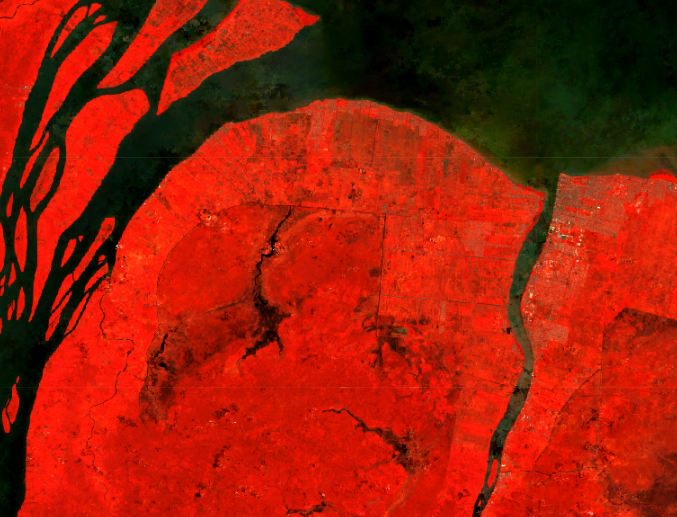
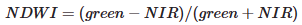
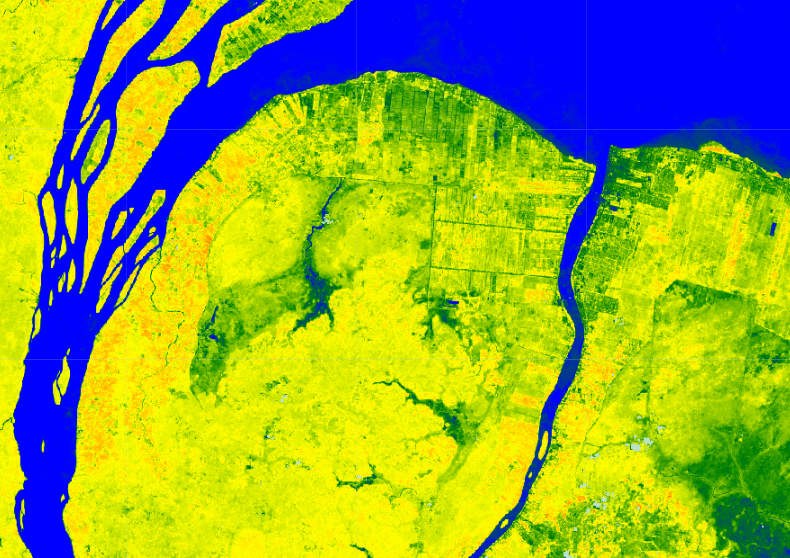
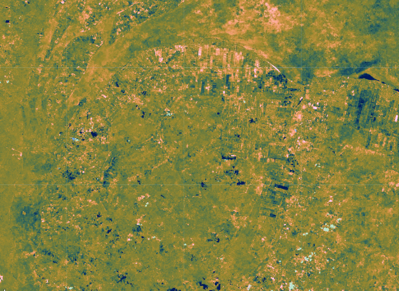
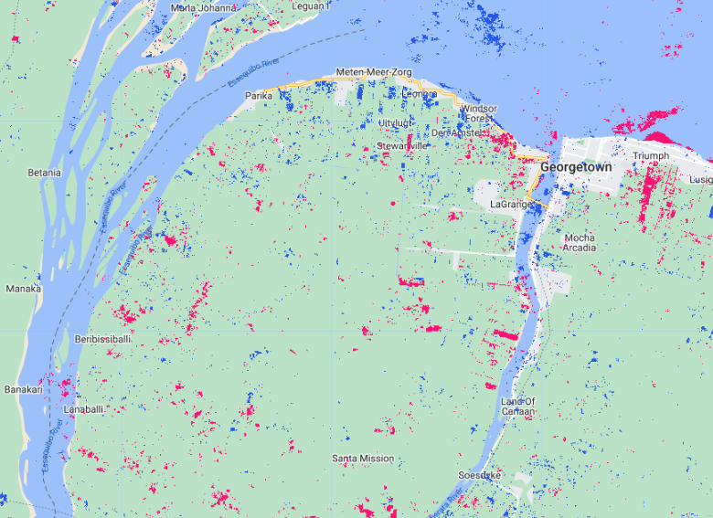

# Part 1 - Two-Date Change Detection with Landsat

# Overview

For the practicum, you will select pre-event and post-event image scenes and investigate the conditions in these images in a false-color composite display. Next, you will calculate the NDWI index for each scene and create a difference image using the two NDWI maps. Finally, you will apply a threshold to the difference image to establish categories of changed versus stable areas. For this demonstration we will capture the difference in surface water levels between 2015 (a historically dry year) and 2021 (a historically wet year).

1. Create a new script file in your own script repository - name it 'Change Detection - Two Date'. Keep in mind a master copy is available in the script repository.
2. Check the full script - [https://code.earthengine.google.com/e2c066722613fec4ac50c18ee5bba557](https://code.earthengine.google.com/e2c066722613fec4ac50c18ee5bba557)

# Preparing Imagery

Before beginning a change detection workflow, image preprocessing is essential. The goal is to ensure that each pixel records the same type of measurement at the same location over time. These steps include multitemporal image registration and radiometric and atmospheric corrections, which are especially important. A lot of this work has been automated and already applied to the images that are available in Earth Engine. Image selection is also important. Selection considerations include finding images with low cloud cover and representing the same phenology (e.g., leaf-on or leaf-off).

The code in the block below accesses the USGS Landsat 8 Level 2, Collection 2, Tier 1 dataset and assigns it to the variable landsat8. To improve readability when working with the Landsat 8 ImageCollection, the code selects bands 2–7 plus the QA band and renames them to band names instead of band numbers.

```js
//--------------------------------------------------------------
// Import Data (AOI, cloud-masked Landsat)
//--------------------------------------------------------------

// import Landsat 8 imagery and select necessary bands
var landsat8 = ee.ImageCollection('LANDSAT/LC08/C02/T1_L2')
.select(['SR_B2', 'SR_B3', 'SR_B4', 'SR_B5', 'SR_B6', 'SR_B7','QA_PIXEL'],
['blue', 'green', 'red', 'nir', 'swir1', 'swir2','QA_PIXEL']);
```

Next, you will split the Landsat 8 `ImageCollection` into two collections, one for each time period, and apply some filtering and sorting to get an image for each of two time periods. In this example, we know that cloud cover is an issue for the wet season; therfore to reduce challenges posed by cloud cover, we are only looking at yearly differences in water rather than a pre-/post- flood event. If you are interested in the latter in the future, SAR data may be of interest. 

The code below does several things. First, it creates a new geometry variable to filter the geographic bounds of the image collections. Next, it creates a new variable for the pre-event image by (1) filtering the collection by the date range of interest (e.g., the whole of 2015), (2) filtering the collection by the geometry, (3) mapping a cloud masking function over each image, and (4) getting the median composite from the collection.

```js
// center the map on a point of interest
var point = ee.Geometry.Point([-58.1853, 6.7823]);
Map.centerObject(point, 9);

// create a cloud masking function
function cloudShadowMask(image) {
  // Bits 3 and 4 are cloud and cloud shadow, respectively.
  var cloudShadowBitMask = (1 << 4);
  var cloudsBitMask = (1 << 3);
  // get the pixel QA band
  var qa = image.select('QA_PIXEL');
  // both flags should be set to zero, indicating clear conditions.
  var mask = qa.bitwiseAnd(cloudShadowBitMask).eq(0)
                .and(qa.bitwiseAnd(cloudsBitMask).eq(0));

  return ee.Image(image).updateMask(mask);
}

// filter Landsat imagery for location, time period, and cloud mask

// select a dryer year for the "pre" image
var preImage = landsat8
    .filterBounds(point)
    .filterDate('2014-01-01', '2014-12-31')
    .map(cloudShadowMask)
    .median();
```

Now repeat the previous step, but assign it to a post-event image variable and change the filter date to a later period, in this case one of the wetter years in recent history of Guyana. 

```js
// select a wetter year for the "post" image
var postImage = landsat8
    .filterBounds(point)
    .filterDate('2021-01-01', '2021-12-31')
    .map(cloudShadowMask)
    .median();
```

# Creating False-Color Composites

Before running any sort of change detection analysis, it is useful to first visualize your input images to get a sense of the landscape, visually inspect where changes might occur, and identify any problems in the inputs before moving further. As described in the Intro to GEE workshop, false-color composites draw bands from multispectral sensors in the red, green, and blue channels in ways that are designed to illustrate contrast in imagery. Below, you will produce a false-color composite using NIR in the red channel, green in the green channel, and blue in the blue channel.  NIR false-color composites can help highlight vegetation and standing water because NIR is strongly absorbed by water and strongly reflected by plants.

Following the format in the code block below, first create a variable `visParam` to hold the display parameters, selecting the NIR, greem, and red bands, with values drawn that are between 7750 and 22200. Next, add the pre-event and post-event images to the map and click Run. Click and drag the opacity slider on the post-event image layer back and forth to view the changes between your two images. 

```js
// define visualization parameters for NIR false-color imagery
var visParam = {
    'bands': ['nir', 'green', 'blue'],
    'min': 7750,
    'max': 22200
};

// add false-color images to the map
Map.addLayer(preImage, visParam, 'pre false color NIR');
Map.addLayer(postImage, visParam, 'post false color NIR');
```



# Calculating NDWI

The next step is data transformation, such as calculating NDWI. The advantage of using these techniques is that the data, along with the noise inherent in the data, have been reduced in order to simplify a comparison between two images. Image differencing is done by subtracting the spectral value of the first-date image from that of the second-date image, pixel by pixel. Two-date image differencing can be used with a single band or with spectral indices, depending on the application. Identifying the correct band or index to identify change and finding the correct thresholds to classify it are critical to producing meaningful results. Working with indices known to highlight the land cover conditions before and after a change event of interest is a good starting point. For example, the Normalized Difference Water Index would be good for mapping water level changes during flooding events; the NBR is good at detecting soil brightness; and the NDVI can be used for tracking changes in vegetation (although this index does saturate quickly). In some cases, using derived band combinations that have been customized to represent the phenomenon of interest is suggested, such as using the Normalized Difference Fraction Index to monitor forest degradation. 

Examine changes to the landscape caused by flooding using NDWI, which measures the strength of the water signal using the equation 



These bands were chosen because they respond most strongly to the signal of surface water compared to other land cover types. We can see a peak in green reflectance matched with a trough in NIR reflectance for the Water spectral curve in the following figure.


This type of equation, a difference of variables divided by their sum, is referred to as a normalized difference equation. The resulting value will always fall between −1 and 1.

First, calculate the NDWI for each time period using the built-in normalized difference function. For Landsat 8, be sure to utilize the green and NIR bands to calculate NDWI. Then, rename each image band with the built-in rename function. To visualize enough contrast within the NDWI images we set the min and max values more narrower than NDWI's global -1 to 1 value range. 

```js
//--------------------------------------------------------------
// Calculate NDWI
//--------------------------------------------------------------

// Calculate NDWI
var ndwiPre = preImage.normalizedDifference(['green','nir'])
    .rename('ndwi_pre');
var ndwiPost = postImage.normalizedDifference(['green','nir'])
    .rename('ndwi_post');

var ndwiVis = {min:-0.6,max:0.02,palette:['red','yellow','green','blue']}
Map.centerObject(point,13)
Map.addLayer(ndwiPre, ndwiVis, 'NDWI pre')
Map.addLayer(ndwiPost, ndwiVis, 'NDWI post')
```



Code Checkpoint: [https://code.earthengine.google.com/e2c066722613fec4ac50c18ee5bba557](https://code.earthengine.google.com/e2c066722613fec4ac50c18ee5bba557)

# Single Date Change

Next, we will examine the changes that have occurred, as seen when comparing two specific dates in time.

Subtract the pre-event image from the post-event image using the subtract function. Add the two-date change image to the map with the specialized Fabio Crameri batlow color ramp (Crameri et al. 2020). This color ramp is an example of a color combination specifically designed to be readable by colorblind and color-deficient viewers. Being cognizant of your cartographic choices is an important part of making a good change map.

The color ramp has dark blues for the lowest values, greens and oranges in the midrange, and pink for the highest values. We used `ndwiPre` subtracted from `ndwiPost` to identify changes in each pixel. Since NDWI values are higher when water is present, areas that are negative in the change image will represent pixels that were higher in the `ndwiPre` image than in the `ndwiPost` image. Conversely, positive differences mean that an area gained water. 

```js
//--------------------------------------------------------------
// Calculate Change in NDWI
//--------------------------------------------------------------

// calculate change between the two dates
var diff = ndwiPost.subtract(ndwiPre).rename('change');

// define visualization parameters
var palette = [
    '011959', '0E365E', '1D5561', '3E6C55', '687B3E',
    '9B882E', 'D59448', 'F9A380', 'FDB7BD', 'FACCFA'
];
var visParams = {
    palette: palette,
    min: -0.2,
    max: 0.2
};

// add NDWI change image to map
Map.addLayer(diff, visParams, 'NDWI change');
```



*Question:* Try to interpret the resulting image before reading on. What patterns of change can you identify? Can you find areas that look like water loss or gain?

# Classifying Change

Once the images have been transformed and differenced to highlight areas undergoing change, the next step is image classification into a thematic map consisting of stable and change classes. This can be done rather simply by thresholding the change layer, or by using classification techniques such as machine learning algorithms. One challenge of working with simple thresholding of the difference layer is knowing how to select a suitable threshold to partition changed areas from stable classes. On the other hand, classification techniques using machine learning algorithms partition the landscape using examples of reference data that you provide to train the classifier. This may or may not yield better results, but does require additional work to collect reference data and train the classifier. In the end, resources, timing, and the patterns of the phenomenon you are trying to map will determine which approach is suitable—or perhaps the activity you are trying to track requires something more advanced, such as a time-series approach that uses more than two dates of imagery.

For this chapter, we will classify our image into categories using a simple, manual thresholding method, meaning we will decide the optimal values for when a pixel will be considered change or no-change in the image. Finding the ideal value is a considerable task and will be unique to each use case and set of inputs (e.g., the threshold values for a SWIR2 single-band change would be different from the thresholds for NDVI).

First, you will define two variables for the threshold values for gain and loss. Next, create a new image with a constant value of 0. This will be the basis of our classification. Reclassify the new image using the where function. Classify loss areas as 2 where the difference image is less than or equal to the loss threshold value. Reclassify gain areas to 1 where the difference image is greater than or equal to the gain threshold value. Finally, mask the image by itself and add the classified image to the map (Fig. F4.4.5). Note: It is not necessary to self-mask the image, and in many cases you might be just as interested in areas that did not change as you are in areas that did.

```js
//--------------------------------------------------------------
// Classify NDWI Change
//--------------------------------------------------------------

// create thresholds for the change classification
var thresholdGain = 0.10;
var thresholdLoss = -0.10;

// create an empty image to use as a base for the classification
var diffClassified = ee.Image(0);

// add a value of 2 to the image where water was lost
diffClassified = diffClassified.where(diff.lte(thresholdLoss), 2);
// add a value of 1 to the image where water was gained
diffClassified = diffClassified.where(diff.gte(thresholdGain), 1);

// define visualization parameters
var changeVis = {
    palette: 'fcffc8,2659eb,fa1373',
    min: 0,
    max: 2
};

// add the classified NDWI tchange to the map
Map.addLayer(diffClassified.selfMask(),
    changeVis,
    'NDWI change classified');
```



Code Checkpoint: (https://code.earthengine.google.com/e2c066722613fec4ac50c18ee5bba557)[https://code.earthengine.google.com/e2c066722613fec4ac50c18ee5bba557]

# Synthethis

Evaluating any maps you create, including change detection maps, is essential to determining whether the method you have selected is appropriate for informing land management and decision-making (Stehman and Czaplewski 1998), or whether you need to iterate on the mapping process to improve the final results. Maps generally, and change maps specifically, will always have errors. This is due to a suite of factors, such as the geometric registration between images, the calibration between images, the data resolution (e.g., temporal, spectral, radiometric) compared to the characteristics of the activity of interest, the complexity of the landscape of the study region (topography, atmospheric conditions, etc.), and the classification techniques employed (Lu et al. 2004). This means that similar studies can present different, sometimes controversial, conclusions about landscape dynamics (e.g., Cohen et al. 2017). In order to be useful for decision-making, a change detection mapping effort should provide the user with an understanding of the strengths and weaknesses of the product, such as by presenting omission and commission error rates. The quantification of classification quality is presented in EEFA book Chap. F2.2.

# Challenges

**Challenge 1:** 
Try using a different index, such as MNDWI (Modified Normalized Difference Water Index) or a Tasseled Cap Transformation (refer to EEFA book chapter [F3.1 - Section 2 Manipulating Images with Matrix Algebra](https://www.eefabook.org/table-of-contents.html)), to run the change detection steps, and compare the results with those obtained from using NDWI.

**Challenge 2:** 
Experiment with adjusting the `thresholdLoss` and `thresholdGain` values.

**Challenge 3:** 
Use what you have learned in the Mangrove Mapping and Flood Mapping workshops to run a supervised classification on the difference layer (or layers, if you have created additional ones). Hint: To complete a supervised classification, you would need reference examples of both the stable and change classes of interest to train the classifier.

**Challenge 4:** 
Think about how things like clouds and cloud shadows could affect the results of change detection. What do you think the two-date differencing method would pick up for images in the same year in different seasons?
