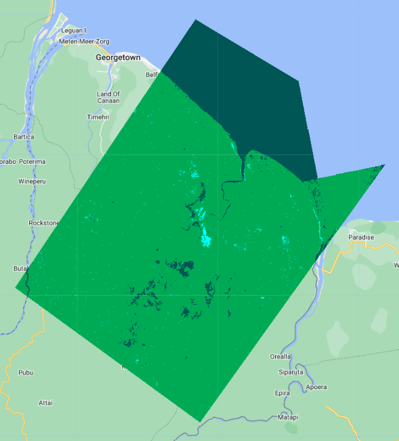

# Part 2 - Mapping Flooded Areas using SAR

# Overview

In this case study, we will train a classifer to predict flooded land covers using Sentinel 1 SAR scenes collected in both dry and wet seasons.

1. Create a new script file in your own script repository - name it 'Flood Mapping - SAR'. Keep in mind a master copy is available in the script repository.
2. Check the full script - [https://code.earthengine.google.com/36484d3506fb35468aa8e5a0bf80d3e9](https://code.earthengine.google.com/36484d3506fb35468aa8e5a0bf80d3e9)

**General Supervised Classification Workflow**

Step 1. Load the image or images to be classified 

Step 2. Gather the training data: 
  * Collect training data to teach the classifier 
  * Collect representative samples of backscatter for each landcover class of interest 

Step 3. Create the training dataset: 
  * Overlay the training areas over the images of interest 
  * Extract backscatter for those areas 

Step 4. Train the classifier and run the classification 

Step 5. Validate your results

# Create Area of Interest

We will utilize the geometry drawing tools in the **Map** window to draw an area of interest. 

In the top-left of the Map window, select the **draw a shape** button, then create your polygon. 

At the top of your script, rename it from `geometry` to `aoi`.


# Import NICFI Data

We will import some extra data to help with identifying different land cover types when we create training points later.  We will use visible RGB imagery and NDVI derived form Norway's International Climate and Forests Initiative (NICFI) data from Planet Labs.  Through this data set, Planet has made high resolution satellite imagery of tropical regions publicly available for free.

Read more about NICFI here: [https://www.planet.com/nicfi/#:~:text=This%20program%20makes%20high%2Dresolution,Reflectance%20Mosaics%2C%20and%20Archive%20data.](https://www.planet.com/nicfi/#:~:text=This%20program%20makes%20high%2Dresolution,Reflectance%20Mosaics%2C%20and%20Archive%20data.)


```js
//--------------------------------------------------------------
// Import data (NICFI and Copernicus SAR)
//--------------------------------------------------------------

// import Planet Labs NICFI data

// (this collection is not publicly accessible. To sign up for access,
// see https://developers.planet.com/docs/integrations/gee/nicfi)
var nicfi = ee.ImageCollection('projects/planet-nicfi/assets/basemaps/americas');

// filter NICFI basemaps by date  for the wet and dry season
// and get the median image
var NICFI = nicfi.filter(ee.Filter.date('2021-01-01','2021-12-31')).median();

// define visualization parameters 
var NICFIvis = {'bands':['R','G','B'],'min':64,'max':5454,'gamma':1.8};

// add NICFI to map
Map.addLayer(NICFI, NICFIvis, 'NICFI');

// optionally, add NICFI derived NDVI to the map as well
Map.addLayer(
    NICFI.normalizedDifference(['N','R']).rename('NDVI'),
    {min:-0.55,max:0.8,palette: [
        '8bc4f9', 'c9995c', 'c7d270','8add60','097210'
    ]}, 'NICFI NDVI');

```

If you try to run your script now, you can see that GEE cannot load the NICFI imagery unless you have signed up for a Planet account and requested access to NICFI imagery in the account. 

Here are the instructions to do that: [https://developers.planet.com/docs/integrations/gee/nicfi/](https://developers.planet.com/docs/integrations/gee/nicfi/).


# Import and Prepare SAR Data

Load the Sentinel-1 C-band SAR Ground Range dataset, filtering it based on several metadata items and your AOI.

*Tip:* Here is a link to the metadata of the Sentinel-1 SAR data to help you understand the different parameters we filtered on: [https://developers.google.com/earth-engine/datasets/catalog/COPERNICUS_S1_GRD](https://developers.google.com/earth-engine/datasets/catalog/COPERNICUS_S1_GRD)

```js
// import SAR data from Copernicus
var collection = ee.ImageCollection('COPERNICUS/S1_GRD') 
.filter(ee.Filter.eq('instrumentMode', 'IW'))
// .filter(ee.Filter.eq('orbitProperties_pass', 'ASCENDING'))
// .filterMetadata('resolution_meters','equals',10)
.filterBounds(aoi)
.select('VV','VH')
```

We want to retrieve one S1 scene each from the wet season and the dry season. For each period, we will define a start and end date with which to filter the whole Sentinel S1 collection, select the first scene from the result and clip it to our AOI.

```js
// extract one observation from the dry and wet period SAR data
var wet = collection.filterDate('2021-07-01','2021-07-31').median().clip(aoi);
var dry = collection.filterDate('2021-02-01','2021-02-28').median().clip(aoi);

// define visualization parameters
var visVV = {bands:['VV'],min:-30,max:0};
var visVH = {bands:['VH'],min:-30,max:0};
Map.centerObject(aoi,7);

// add SAR to map
Map.addLayer(dry.clip(aoi),visVV,'SAR dry season VV');
Map.addLayer(dry.clip(aoi),visVH,'SAR dry season VH');
Map.addLayer(wet.clip(aoi),visVV,'SAR wet season VV');
Map.addLayer(wet.clip(aoi),visVH,'SAR wet season VH');
```


To reduce the salt-and-pepper effect on our eventual product, we apply a smoothing function across each scene with a focal window. Toggle between the original SAR scene and the speckle filtered result to see the effect.

```js
// apply speckle filter
var smoothingRadius = 50;
var dryFiltered = dry.focal_mean(smoothingRadius,'circle','meters');
var wetFiltered = wet.focal_mean(smoothingRadius,'circle','meters');

// add filtered SAR to map
Map.addLayer(dryFiltered, visVV,'SAR dry season - speckle filter',false);
Map.addLayer(wetFiltered, visVV,'SAR wet season - speckle filter',false);
```


# Create Reference Data

To run a supervised classification, we must collect reference data to "train" the classifier. This involves collecting representative samples of SAR backscatter data for each map class of interest.

Using the Satellite basemap, NICFI layers, and wet/dry season SAR layers in your map, we will draw representative polygons for several classes: Open Permanent Water, Flooded Vegetation, and Forest.

Below is the workflow for creating reference data directly in Earth Engine. We will use Open Permanent Water as the example.

1. In the geometry drawing toolbar (top-left of the **Map** panel), go to **Geometry Imports** and click **new layer**.


2. Click on the **Edit layer properties** button (cog icon next to the geometry's name) to configure the new geometry layer. Name the new layer 'openWater' and change its color. Under **Import as**, change it to `FeatureCollection`. Finally, click on the **+ Property** button and enter a new property 'landcover' with a value of 0.  Each geometry layer, imported to your script now as a `FeatureCollection` will represent one class within your map product. 


3. Draw representative polygons on the map. Click again on the geometry layer **openWater** in the **Geometry Imports** panel and ensure it shows up in bold text. Then click on the **draw a shape** icon. Draw your open water polygons. 


Repeat these steps for each of the remaining map classes: Flooded Vegetation and Forest. To get through this demonstration, shoot for 3 or 4 large polygons or 7 or 8 smaller ones per class. We can refine the quality of our reference data later if we have time.

*Note:* Since each geometry layer represents its own map class, the value for the `landcover` property must change when you are at the configuration step. For example, use landcover value of 2 for the next geometry layer that you create. 

# Create Training and Testing Data

Now that we have reference polygons for our map classes, we will merge their `FeatureCollections` into one. Be mindful of the names that you gave to each polygon feature collection for this next line of code. 

```js
//--------------------------------------------------------------
// Create training data
//--------------------------------------------------------------

// merge training FeatureCollections
var newFc = openWater.merge(floodedVegetation).merge(forest);
```

Code Checkpoint: [https://code.earthengine.google.com/36484d3506fb35468aa8e5a0bf80d3e9](https://code.earthengine.google.com/36484d3506fb35468aa8e5a0bf80d3e9)

Next, we will use the merged `FeatureCollection` of reference polygons to extract the SAR backscatter pixel values for each landcover. The polygons within the `newFc` `FeatureCollection` are overlaid on the image, and each pixel is converted to a point containing the image's pixel values and the other properties inherited from the polygon (in our case 'landcover' property). After you run this, note in the **Console** the total size of reference points we now have to train and validate our map. 

```js
// add training polygons to map
Map.addLayer(newFc, {}, "training polygons");

// define bands to be used to train the data
var bands = ['dryVV','dryVH','wetVV','wetVH'];

// combine dry and wet season composite SAR data
var final = ee.Image.cat(dryFiltered, wetFiltered)
.rename(['dryVV','dryVH','wetVV','wetVH']);
print('combined dry/wet season SAR data:', final);

// extract merged SAR data to the training polygons
var samples = final.select(bands).sampleRegions({
  collection:newFc,
  properties:['landcover'],
  scale:30});
print('Sample size: ',samples.size());
```

Next, we want to set aside 80% of the reference points to train our classifier, and use the remaining 20% for validation. We do this simply by adding a new column to the reference point set called 'random', which contains random decimal numbers between 0 and 1, then filtering them into the two groups.

```js
//split sample data into training and testing
var trainTest = samples.randomColumn();
print('First train/test sample:', trainTest.first());
var training = trainTest.filter(ee.Filter.lte('random',0.8));
var testing = trainTest.filter(ee.Filter.gt('random',0.8));
print('Training size: ', training.size());
print('Testing size: ', testing.size());
```


# Create and Apply Classifier

We choose a classifier algorithm from `ee.Classifier` family of functions, and train it on the `training` `FeatureCollection`. We must specify the `classProperty` to be the property we want to map, or predict, with the model, and the `inputProperties` as the SAR backscatter values defined by the `bands` variable. 

*Tip:* Here is a short intro to how CART classification works: [https://towardsdatascience.com/cart-classification-and-regression-trees-for-clean-but-powerful-models-cc89e60b7a85](https://towardsdatascience.com/cart-classification-and-regression-trees-for-clean-but-powerful-models-cc89e60b7a85)

```js
//--------------------------------------------------------------
// Train classifier (CART)
//--------------------------------------------------------------

// train the CART classifier on the training data
var classifier = ee.Classifier.smileCart().train({
  features:training,
  classProperty: 'landcover',
  inputProperties:bands
});
```

Running the classification is as easy as selecting the desired bands from the `final` image (recall it is the dry season scene and wet season scene together), and calling `classify()`.

```js
//--------------------------------------------------------------
// Run classifier (CART)
//--------------------------------------------------------------

// run the CART classification on the SAR imagery
var classified = final.select(bands).classify(classifier)
```

Display the results, modify the color palette if needed. 

```js
// define visualization parameters
// adjust colors according to your land cover stratification
var classVis = {min:0,max:3,palette:['blue','green','cyan']}

// add classification to the map
Map.centerObject(classified,12)
Map.addLayer(classified,classVis,'classified')
```



Right away we can pick out where some features are mixed up between classes, and where the classifier excels. Let's assess the classifier's performance quantitatively now.

# Run Accuracy Assessment

First, lets see how the classifier performed on the training data.

```js
//--------------------------------------------------------------
// Run accuracy assessment
//--------------------------------------------------------------

// Compute training accuracy on training set
print('Error matrix [Training Set]: ', classifier.confusionMatrix());
print('Accuracy [Training Set]: ', classifier.confusionMatrix().accuracy());

```


100% accuracy on the training set sounds impressive but is not a true representation of the classifier's performance since it is the data the model saw during training.

To represent a truer picture of the classifier's performance, we can use the 20% of the samples witheld for testing. 

```js
// classify test set with classifier trained on training set
var classificationVal = testing.classify(classifier);
print('First 5 classified points:', classificationVal.limit(5));

// create confusion matrix for testing set
var confusionMatrix = classificationVal.errorMatrix({
  actual: 'landcover', 
  predicted: 'classification'
});

// print confusion matrix and accuracies for testing set
print('ConfusionMatrix [Testing Set]:', confusionMatrix);
print('Overall Accuracy [Testing Set]:', confusionMatrix.accuracy());
print('Producers Accuracy [Testing Set]:', confusionMatrix.producersAccuracy());
print('Users Accuracy [Testing Set]:', confusionMatrix.consumersAccuracy());
```


An Overall Accuracy (OA) above 90% is quite good, but note that it is the average of all class-specific accuracies. In our case, the OA is inflated by a very high Open Water class accuracy, effectively masking the much lower accuracies of the other classes.

For this methodology to hold up to scientific scrutiny, we would also want to collect a completely independent set of validation points outside this exercise to assess the resulting map with. A platform like [Collect Earth Online](https://www.collect.earth/) is great for this application. Since this is just a demonstration we will move on. 

# Run Classifier on Other Data

Now that we have a trained model, we could _deploy_ it, or apply it to other Sentinel 1 SAR observations quite easily in Earth Engine. Change the start and end date in the `.filterDate` call below to any date range starting in 2015 (Sentinel1 data availability). Remember that the `first()` call is taking the first SAR image within that date range.

```js
//--------------------------------------------------------------
// Run classifier on other data
//--------------------------------------------------------------

// Classify another Sentinel SAR observation

// import SAR data from Copernicus
var collection2 = ee.ImageCollection('COPERNICUS/S1_GRD') 
.filter(ee.Filter.eq('instrumentMode', 'IW'))
// .filter(ee.Filter.eq('orbitProperties_pass', 'ASCENDING'))
// .filterMetadata('resolution_meters','equals',10)
.filterBounds(aoi)
.select('VV','VH')

// one SAR observation from dry season
var newObsDry = collection2.filterDate('2018-02-01','2018-02-28').mean().clip(aoi);
// one SAR observation from wet season
var newObsWet = collection2.filterDate('2018-07-01','2018-07-31').mean().clip(aoi);

Map.addLayer(newObsDry.clip(aoi),vis,'new obs dry season');
Map.addLayer(newObsWet.clip(aoi),vis,'new obs wet season ');

// combine the two season observations
var newObsFinal = ee.Image.cat(newObsDry,newObsWet).rename(bands);
print('New observation final', newObsFinal);

// apply speckle filter
var newObsFiltered = newObsFinal.focal_mean(smoothingRadius,'circle','meters');

// classify with classifier we defined before
var newObsClassified = newObsFiltered.select(bands).classify(classifier)

Map.addLayer(newObsClassified,classVis,'new obs classified')
```


Code Checkpoint: [https://code.earthengine.google.com/36484d3506fb35468aa8e5a0bf80d3e9](https://code.earthengine.google.com/36484d3506fb35468aa8e5a0bf80d3e9)

A pre-trained model such as this one could be useful in deriving insights from new satellite observations quickly. Flood monitoring applications like [HydraFloods](https://hydrafloods-servir.adpc.net/) works this way, with just a few more bells and whistles. 
