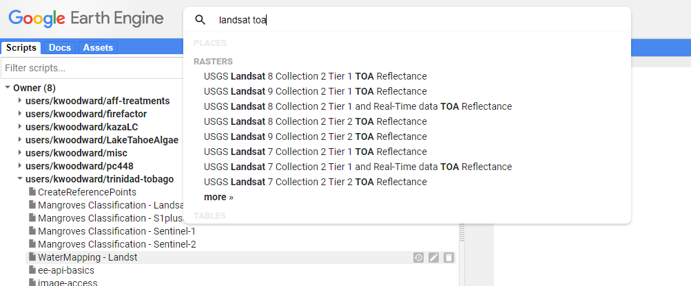
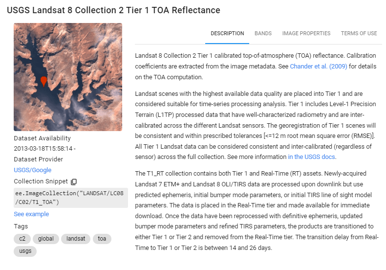
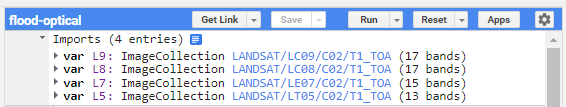
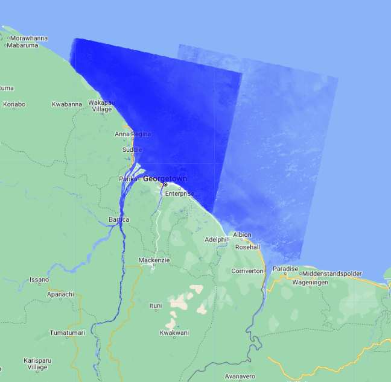
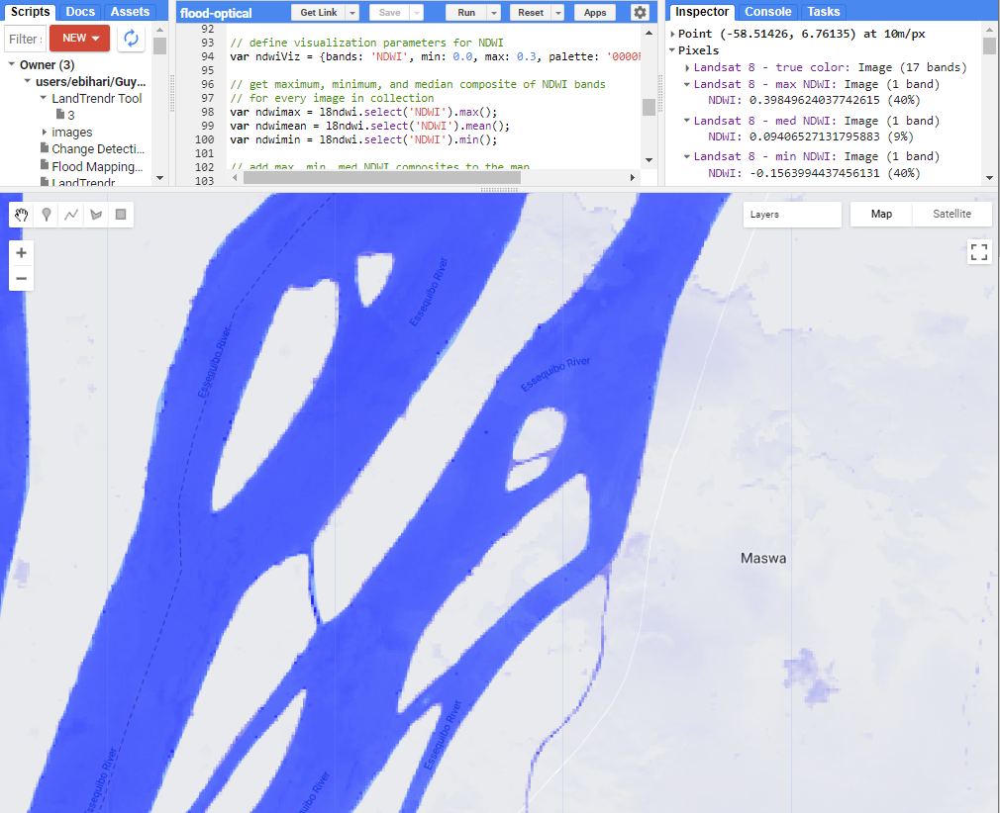
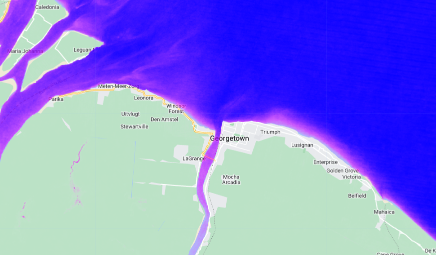

# Overview

In this case study you will develop a tool that maps areas inundated by water for different years based on Landsat 5, 7 and 8.

 This training session was adapted from [SERVIR Mekong Case Study 2 - Surface Water Mapping](https://docs.google.com/document/d/1uyFCMNi1mhiMvwEwFiqOflyUL__uKb7jwwsSLES3hQo/edit)

1. Create a new script file in your own script repository - name it 'Water Mapping - Optical'. Keep in mind a master copy is available in the script repository.
2. Check the full script [https://code.earthengine.google.com/94091350023b90d3d744f4302a4d1b84](https://code.earthengine.google.com/94091350023b90d3d744f4302a4d1b84)

## Theory

High-resolution measurements of the distribution and dynamics of surface water are essential for many environmental applications, such as flood forecasting and warning, agricultural and urban water management, and simulation of transport of pollutants in water bodies. Water can be detected using multi-spectral satellite imagery, as water significantly absorbs most radiation at near-infrared (NIR) wavelengths and beyond. The Normalized Difference Water Index (NDWI) is a simple spectral index that uses the strong absorption of water in NIR to identify water bodies. 

# Import and Preprocess Data

Open the script and import Landsat 5, 7, 8, and 9 Top of Atmosphere (TOA) reflectance `ImageCollections`. In the **Search** bar at the top, type 'Landsat TOA', you will find multiple datasets. 



Click on 'USGS Landsat 8 Collection 2 Tier 1 TOA Reflectance' and in the pop-up dialog box click `Import`



Name the imported `ImageCollection` 'L8'. Now do the same for Landsat 7 TOA, Landsat 9 TOA, and Landsat 5 TOA `ImageCollections`, naming them 'L7', 'L9' and 'L5' respectively.



In your script, set the start and end dates that we will be filtering the `ImageCollections` on.

```javascript
//--------------------------------------------------------------
// Import Data (AOI, cloud-masked Landsat)
//--------------------------------------------------------------

// set start and end date for analysis
var startdate = ee.Date('2013-01-01');
var enddate = ee.Date('2021-12-31');
```

We only want to focus on our country. Therefore we use the 'ADM1_CODE' or 'ADM1_NAME' property to filter the FAO GAUL Administrative Boundary `FeatureCollection` dataset. 

```javascript
// set country/region of interest
var countryName = 'Guyana';
var regionCode = 1402;

// filter the FAO GAUL boundaries for the country of interest
var countries = ee.FeatureCollection("FAO/GAUL/2015/level1");
var aoi = countries.filter(
  ee.Filter.eq('ADM1_CODE', regionCode));

// add AOI to map
Map.addLayer(aoi,{},'AOI');
```

Select Landsat 8 images within the specified time range and region. Print the size of the resulting filtered `ImageCollection`.

```javascript
// filter Landsat 8 image collection for dates of interest and AOI
var l8images = L8.filterDate(startdate, enddate)
    .filterBounds(aoi);
print('Number of Landsat 8 images from filter:', l8images.size());  
```
Make a function to mask the clouds (adjust the threshold if necessary). The simpleCloudScore() function "Computes a simple cloud-likelihood score in the range [0,100] using a combination of brightness, temperature, and NDSI. This is not a robust cloud detector, and is intended mainly to compare multiple looks at the same point for relative cloud likelihood."

*Tip:* Here is the google documentation on the simpleCloudScore() function [https://developers.google.com/earth-engine/apidocs/ee-algorithms-landsat-simplecloudscore](https://developers.google.com/earth-engine/apidocs/ee-algorithms-landsat-simplecloudscore)

```javascript
// set cloud score threshold
var cloudThresh = 20;

// create a mask cloud function with the set threshold
var cloudFunction = function(image){
  var score = ee.Algorithms.Landsat.simpleCloudScore(image).select('cloud');
  var cloudy = score.gt(cloudThresh);
  var cloudmask = cloudy.not();
  return image.updateMask(cloudmask);
};
```

Optionally, lets figure out what the function is doing by applying the function's logic to the first image in the Landsat 8 collection. Paste this code block into your script, un-comment the lines, and hit **Run**. 

```javascript
// how does this function work? 
// // ee.Algorithms.Landsat.simpleCloudScore 
// // "Computes a simple cloud-likelihood score in the range [0,100] 
// // using a combination of brightness, temperature, and NDSI. 
// // This is not a robust cloud detector, and is intended mainly to 
// // compare multiple looks at the same point for relative cloud likelihood."

// // compute the function for the first image outside of function definition
// Map.addLayer(l8images.first(),{},'l8images.first()');
// var score = ee.Algorithms.Landsat.simpleCloudScore(l8images.first()).select('cloud');
// var cloudy = score.gt(cloudThresh);
// var cloudmask = cloudy.not();
// var output = l8images.first().updateMask(cloudmask);
// Map.addLayer(score,{},'score');
// Map.addLayer(cloudy,{},'cloudy');
// Map.addLayer(cloudmask,{},'cloud mask');
// Map.addLayer(output,{
//     min: 0, 
//     max: 0.5,
//     bands: ['B4', 'B3', 'B2'] // what bands should you use for true color?
//   }, 'l8images.first() - cloud masked');
```

Comment-out the above code block again to remove it from your analysis.

Now, map the cloud masking function over the Landsat 8 collection. 

```javascript
// apply cloud masking function to every image in collection 
// using .map() function
var l8CloudMasked = l8images.map(cloudFunction);
```

Display the median of the image collection for your region for Landsat 8. What bands should you use to display the image as a true color image?

```javascript
// center map over aoi at zoom scale
Map.centerObject(aoi, 9);

// add cloud masked median composite to map
Map.addLayer(l8CloudMasked.median().clip(aoi), {
    min: 0, 
    max: 0.3,
    bands: ['B4', 'B3', 'B2']
  }, 'Landsat 8 - true color');
```

# Calculate NDWI

Lookup the band designations of Landsat 8. Use the **Search** bar at the top like before to lookup each collection. Alternatively, if the given dataset is already imported you can click on your imports at the top of your script (see figure above).

Now we are going to calculate the Normalized Difference Water Index (NDWI) using the Landsat 8 images.  NDWI can be used to identify areas covered with water and is given by:

$NDWI = (green-NIR)/(green + NIR)$

We make a function that calculates the NDWI for each image in a collection.  The function needs the Green and NIR bands from the equation above to be named 'green' and 'nir'.  NDWI is added as a band to each image.

```javascript
//--------------------------------------------------------------
// Calculate NDWI
//--------------------------------------------------------------
  
// create a function for NDWI calculation
// NDWI = (green-NIR)/(green + NIR)
function addNdwi(img) {
  var ndwi = img.normalizedDifference(['green', 'nir']).rename('NDWI');
  return img.addBands(ndwi);
}
```

The next step is to run the function for each image in the Landsat 8 collection. First, rename the bands as appropriate, then use the `map()` function to calculate NDWI for all the images in the collection. Print the first image of the `l8ndwi` collection to verify that the band NDWI has been added.

```javascript
// rename bands necessary for calculation
var bands = ['green', 'nir'];

// map the NDWI function to every image
var l8ndwi = l8CloudMasked
    .select(['B3', 'B5'], bands)
    .map(addNdwi);
print(l8ndwi.first());
```

Now we are going to visualize the results for Landsat 8 by taking the maximum, mean, and minimum values of the image collection.

What happens you use `.max()` vs. `.mean()` vs. `.min()`? What is the purpose of `ndwimax.selfMask()`?

```javascript
// define visualization parameters for NDWI
var ndwiViz = {bands: 'NDWI', min: 0.0, max: 0.3, palette: '0000FF'};

// get maximum, minimum, and median composite of NDWI bands 
// for every image in collection
var ndwimax = l8ndwi.select('NDWI').max();
var ndwimean = l8ndwi.select('NDWI').mean();
var ndwimin = l8ndwi.select('NDWI').min();

// add max, med, min NDWI composites to the map
Map.addLayer(ndwimax.mask(ndwimax), ndwiViz, 'Landsat 8 - max NDWI');
Map.addLayer(ndwimean.mask(ndwimean), ndwiViz, 'Landsat 8 - med NDWI');
Map.addLayer(ndwimin.mask(ndwimax), ndwiViz, 'Landsat 8 - min NDWI');
```



Zoom into an area you are familiar with. Click the **Inspector** tab then click on the map with your cursor. What is the mean NDWI there? What is the max?



Code Checkpoint: []()

Next we will calculate the NDWI for Landsat 5 and Landsat 7. Note that the bands designations are different.  Open the **Data Catalog** information on Landsat 5, Landsat 7, and Landsat 9 to see which bands correspond to Green and NIR wavelengths. Remember, you can click on your script's imported datasets at the top to open the **Data Catalog** information. 

In the next step, we will do the filtering, cloud masking, band selection and NDWI computation all at once to the Landsat 5 and Landsat 7 collections.  (The date cutoffs are arbitrary.)

```javascript
// preprocess Landsat5, Landsat7, and Landsat9 the same way as Landsat8
var l5ndwi = L5
  .filterBounds(aoi)
  .filterDate('1984-01-01', '1998-12-31')
  .map(cloudFunction)
  .select(['B2', 'B4'], bands)
  .map(addNdwi);

var l7ndwi = L7
  .filterBounds(aoi)
  .filterDate('1999-01-01', '2012-12-31')
  .select(['B2', 'B4'], bands)
  .map(addNdwi);
  
var l9ndwi = L9
  .filterBounds(aoi)
  .filterDate('2021-01-01', '2022-12-31')
  .select(['B3', 'B5'], bands)
  .map(addNdwi);
```

Since the bands are now homogeneous between the 4 Landsat `ImageCollections`, we can merge them.

```javascript
// Merge all 4 Landsat missions together
var collection = ee.ImageCollection(
  l5ndwi.merge(l7ndwi).merge(l8ndwi)).merge(l9ndwi);
```

You can now make a water layer for any year in the merged collection by filtering it to the desired date range.  For example:

```js
// set the year of interest
var year = 2000;

// extract the maximum NDWI from the year of interest
var ndwi2000 = collection.filterDate({
  start: ee.Date.fromYMD(year, 1, 1),
  end: ee.Date.fromYMD(year, 12, 31)
}).max();

// add this NDWI to map
Map.addLayer(ndwi2000.selfMask(), ndwiViz, 'max NDWI - 2000');
```

You can also compute things like frequency of inundation (the zero threshold is arbitrary). Uncomment the commented out code to better understand what the `frequency` is doing with `waterBinary`.

# Calculate Flooding Frequency

```js
//--------------------------------------------------------------
// Calculate Flooding Frequency
//--------------------------------------------------------------

// create a binary water layer using a threshold
var waterBinary = collection.select('NDWI').map(function(image) {
  return image.gt(0);
});

// add water to map to look at the series
// Map.addLayer(waterBinary,{},'water binary - 1998-2022')

// calculate the inundation frequency
var frequency = waterBinary.sum().divide(waterBinary.count());

// add inundation frequency to map
Map.addLayer(frequency.selfMask(), 
  {palette: ['white', 'magenta', 'blue']}, 'inundation frequency - 1998-2022');
```


Code Checkpoint: []()

**Challenge 1:** modify the start and end parameters to map surface water detected in one season of the year over several years. 

**Challenge 2:** The Sentinel-2 satellite has a higher spatial resolution than the Landsat satellites. Calculate the NDWI for a Sentinel-2 image. 