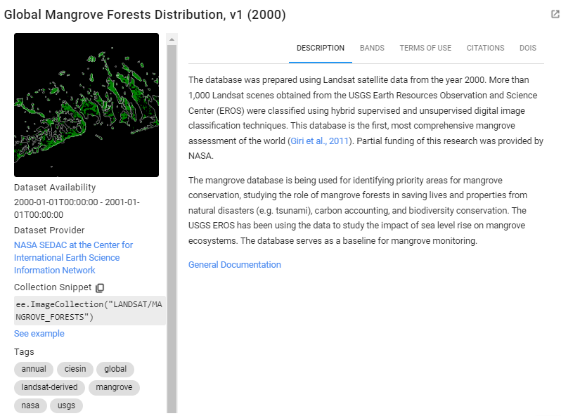
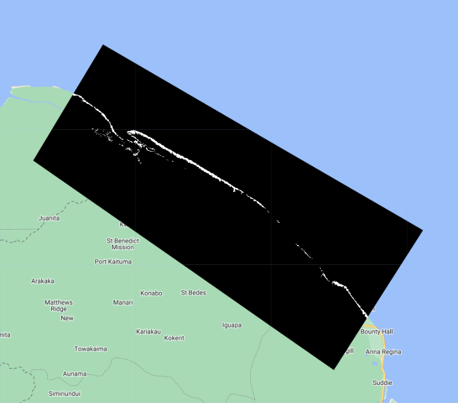
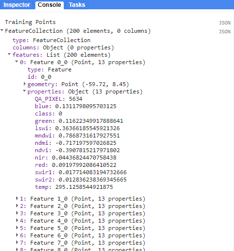
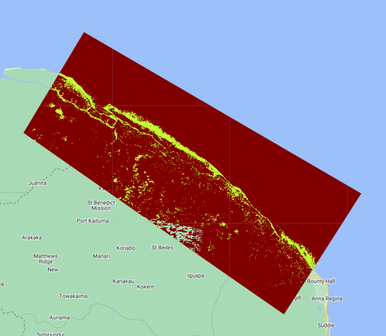

# Part 2 - Running Classification

# Creating Sample Data

To train a mangrove classification model, we need presence/absence data on the locations of mangroves. There are several widely cited mangrove datasets out there now. The [Giri et al 2011 dataset](https://onlinelibrary.wiley.com/doi/abs/10.1111/j.1466-8238.2010.00584.x) is already in the GEE data catalog, it contains a mangrove extent map circa 2000.



This dataset is an `ImageCollection` containing tiled raster data. Let's mosaic the tiles together, clip it to our AOI and check it out.

```javascript
//--------------------------------------------------------------
// Create training data
//--------------------------------------------------------------

// We will auto-generate Mangrove presence-absence reference points 
// from the Giri et al 2000 Mangrove Extent Map
// Process the Mangrove Forests imageCollection into a clipped raster

// Load the mangrove extent image collection
// clip to aoi, unmask, rename band
var giriMangrovesTT = ee.ImageCollection("LANDSAT/MANGROVE_FORESTS")
.filterBounds(aoi)
.mosaic()
.unmask(0)
.clip(aoi)
.rename('class')

// Add image to map
Map.addLayer(giriMangrovesTT,{min:0,max:1},
            'Giri Mangrove Extent Map T&T',false)
```



Now that we have a presence/absence mangrove map, we can draw reference samples which will be used to train and validate our mangrove classification. First, lets generate a stratified sample of presence and absence points from the magrove presence/absence raster. We specify that we want 100 points of Mangrove and 100 points of Not Mangrove. 

```javascript
// Create stratified random sample from the processed mangrove raster
// Values in 'class' property: 0-Not Mangrove,  1-Mangrove
var collectedPts = giriMangrovesTT.stratifiedSample({
  // total # points
  numPoints:200, 
  classBand:'class', 
  region:aoi, 
  scale:30, 
  projection:'EPSG:3857', 
  seed:01010, 
  classValues:[0,1],
  // # points in each class
  classPoints:[100,100], 
  dropNulls:true, 
  tileScale:2, 
  geometries:true});
print('Collected Points', collectedPts)

// Optionally you can export and re-import it
// Export.table.toAsset(collectedPts,'mangroveSamples','users/ebihari/GuyanaWS/images/referencePoints_GiriMangroves_100ea')
// var collectedPts = ee.FeatureCollection("users/ebihari/GuyanaWS/images/referencePoints_GiriMangroves_100ea")

```

Next, we must extract the raster values of the Landsat composite to each reference point. Let's see what we have in `trainingPts`.  We also split it out into 80% training points and 20% testing points so we have points to test the model with later.

```javascript
// Extract spectral information at each point
var trainingPts = composite.sampleRegions({
    collection: collectedPts, 
    properties: ['class'], 
    scale: 30,
    geometries:true
  });
print('Training Points', trainingPts);

// Divide points into training and testing points.
// Create random column in reference points.
var trainingTesting = trainingPts.randomColumn();
print(trainingTesting);

// Divide 80% of data for training and 20% for testing.
var trainingData = trainingTesting.filter(ee.Filter.lt('random', 0.8));
print('Number of training points', trainingData.size());
var testingData = trainingTesting.filter(ee.Filter.gte('random', 0.8));
print('Number of testing points', testingData.size());

Map.addLayer(trainingData, {color: '429ef5'}, 'Training points'); // Blue
Map.addLayer(testingData, {color: '000000'}, 'Testing points'); // Black
```



Each point within the `FeatureCollection` contains the value of the underlying pixel for every band in our Landsat composite image. Each band's name and value is stored as a property in the point feature. 

# Running the Classification

Now that we have generated our image composite and our training data, it is time to train the Random Forest and classify our composite with it. 

We train a Random Forest classifier with only the training point subset. 

*Tip:* Here is a short intro to how random forest classification works: [https://www.ibm.com/topics/random-forest](https://www.ibm.com/topics/random-forest)

```javascript
//--------------------------------------------------------------
// Run classification
//--------------------------------------------------------------

// Define prediction bands
// Get all image bands except the QA band
var predictionBands =  landsatFiltered.first().bandNames().remove('QA_PIXEL'); 
print('Prediction Bands', predictionBands)

// Train the classifier with training points only
// "Call" the random forest classifier and train it with the training points
var RFclassifierVal = ee.Classifier.smileRandomForest({numberOfTrees:10}).train({
  features: trainingData, 
  classProperty: 'class',
  inputProperties: predictionBands
});

// Print decision trees
var decisionTrees = RFclassifierVal.explain();
print('Decision trees', decisionTrees);

// Classify the median composite
var RFclassification = composite
.select(predictionBands)
.classify(RFclassifierVal);

// Define color palette for the classified image
// (grab from geometry tools for each class)
var colorPalette = ['d63000', '98ff00'];

// Add classified image to map
Map.addLayer(RFclassification, {min: 0, max: 1, palette: colorPalette}, 
            'RF Classification');
```



Then we take this trained RF classifer to classify the testing point subset. Finally, we retrieve the error matrix from the classified test set and print accuracy metrics to the console.


```javascript
// Test the classification (model precision) with testing data.
var classificationVal = testingData.classify(RFclassifierVal);
print('Classified points', classificationVal);

// Create confusion matrix
var confusionMatrix = classificationVal.errorMatrix({
  actual: 'class', 
  predicted: 'classification'
});

// Print confusion matrix and accuracies
print('Confusion matrix:', confusionMatrix);
print('Overall Accuracy:', confusionMatrix.accuracy());
print('Producers Accuracy:', confusionMatrix.producersAccuracy());
print('Users Accuracy:', confusionMatrix.consumersAccuracy());
```


Code Checkpoint: [https://code.earthengine.google.com/05e2efede37db5059fd732c1760c9852](https://code.earthengine.google.com/05e2efede37db5059fd732c1760c9852)

Congratulations! You have setup a Random Forest classifier for mangrove mapping using multiple Landsat sensors. 
