# Map Making

Making and customizing a map is a crucial component of GIS analysis. We will use a set of height points generated from Google Earth for the study area in order to create a digital elevation model (DEM).

First, we generate a set of points (path) in Google Earth. We add our only-land protected area shapefile.

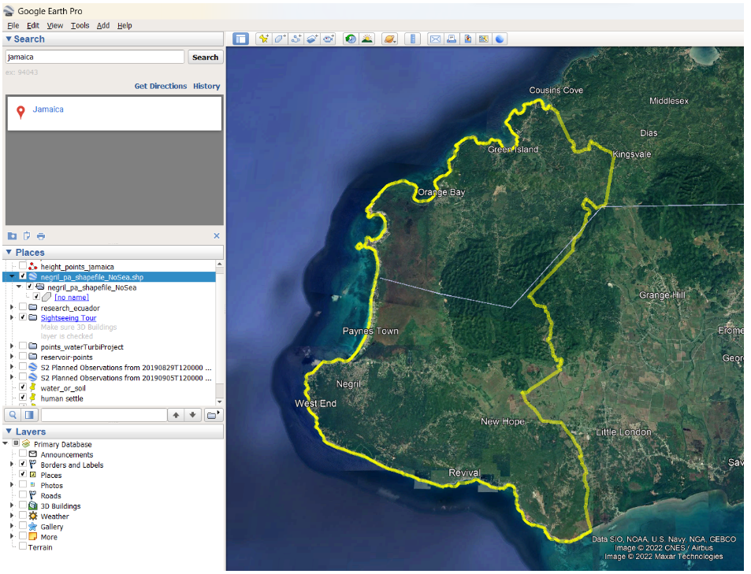

Let’s add a path over our layer and trace it through the entire study area:

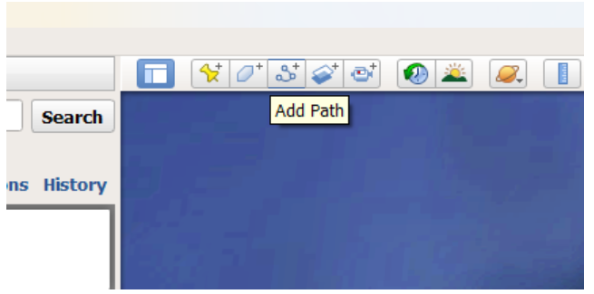

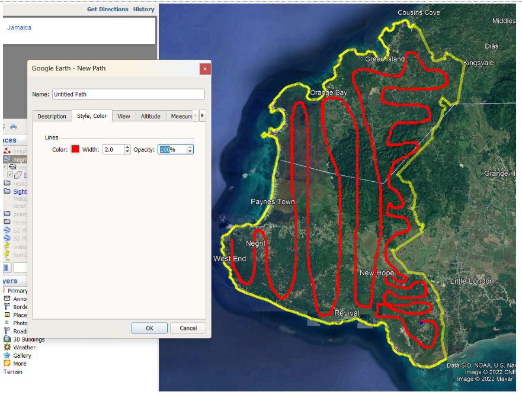

Let’s call the path **points_jamaica_pa** and use the ‘Save Place as’ option with the extension *.kml*.

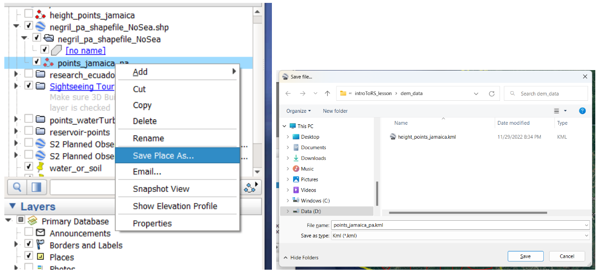

Now we can use any of the online web services available, for example GPS visualizer [(https://www.gpsvisualizer.com/elevation)](https://www.gpsvisualizer.com/elevation) to convert our Kml file into a GPX file, which is a valid format for height points entry in QGIS. We use the Convert & add elevation button, then download the file.

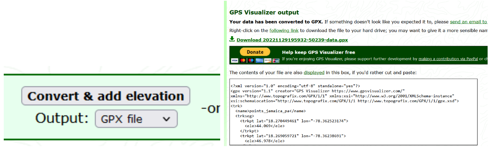

We can rename the downloaded file. Now we go to QGIS. Let’s make sure we have installed the GPX Segment Importer.

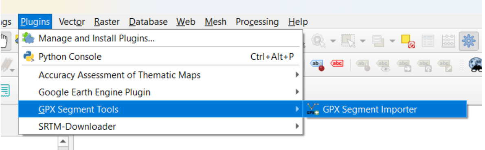

And we import the GPX file.

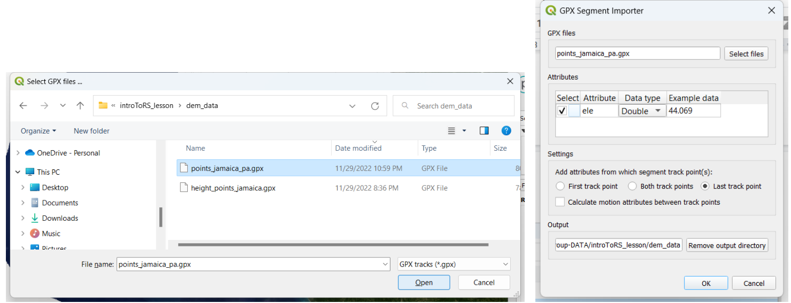

Later, we extract the vertices.  We set an output file name as **points_jamaica_pa.shp**.

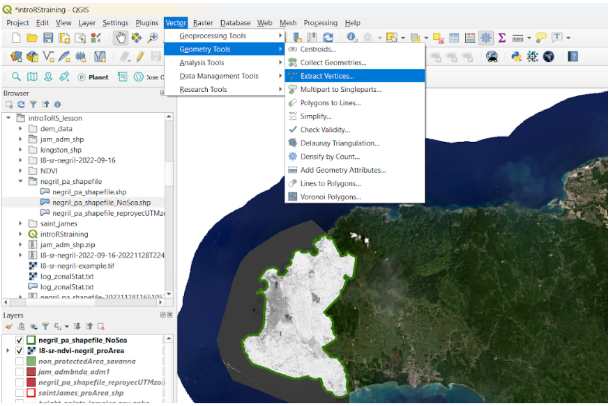

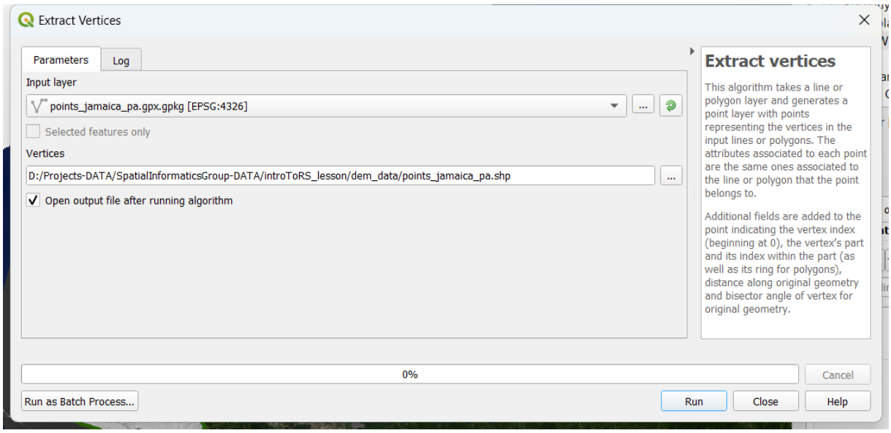

We run the process and we obtain our shapefile of elevation points. Let’s open the attribute table of the file and we will be able to see the elevation field with the information required for the digital elevation model (DEM) creation.

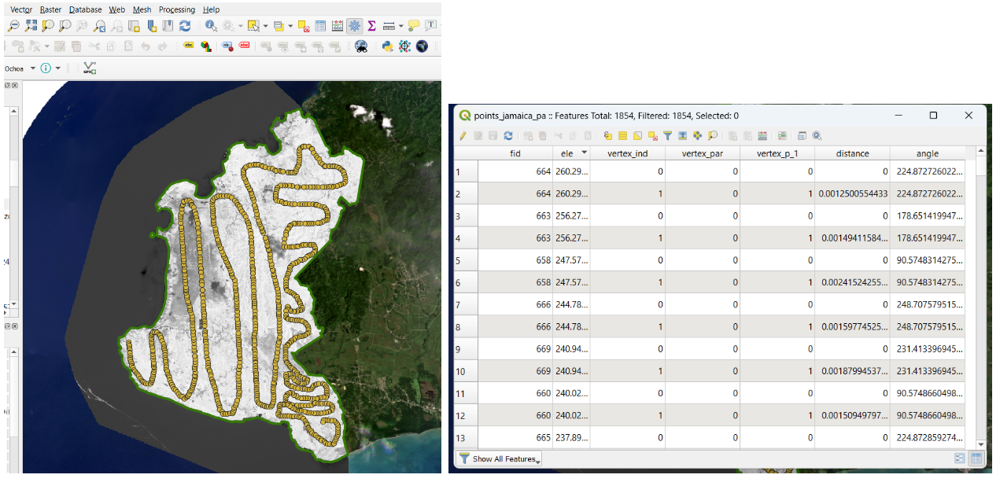

Now, it’s time to generate our DEM. We have to open the ToolBox and look for the Inverse Distance Weighted (IDW) function.

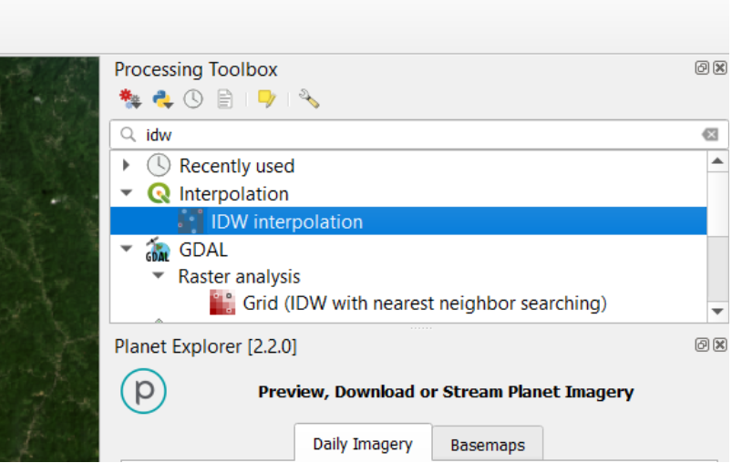

We select our shapefile of points or vertices and the attribute for interpolation ***‘ele’***.

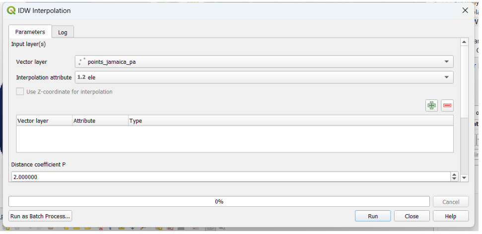

We click on the plus button and the corresponding layer is aggregated.  We set the extent from our **negril_pa_shapefile_NoSea** shapefile, define a name **dem_negril_pa.tif**, and Run the process.

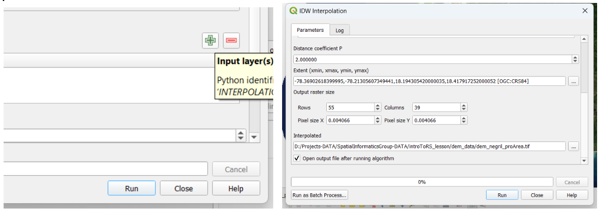

Our DEM is finally created. It looks gray colored, so we need to define an appropriate visualization setting.

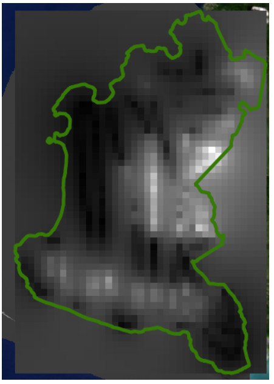

We go to Properties → Symbology → we select the single band pseudo-color option. Then we choose a New ramp of color:

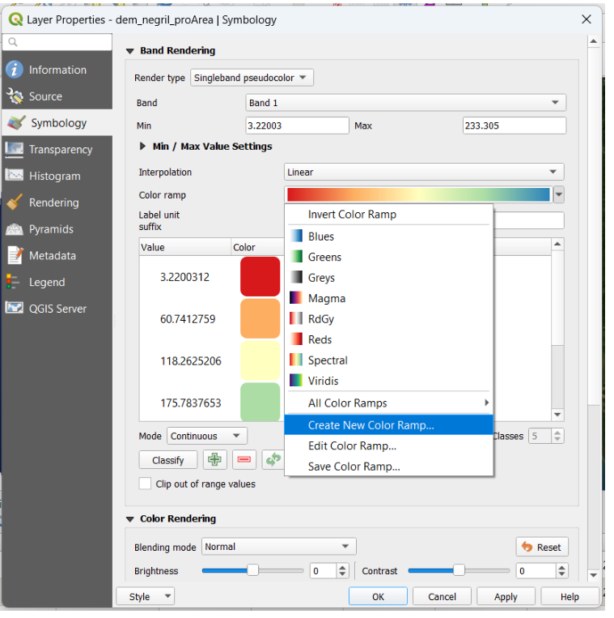

Next, we select the type of ramp option, the category Topography, and pick the elevation palette.

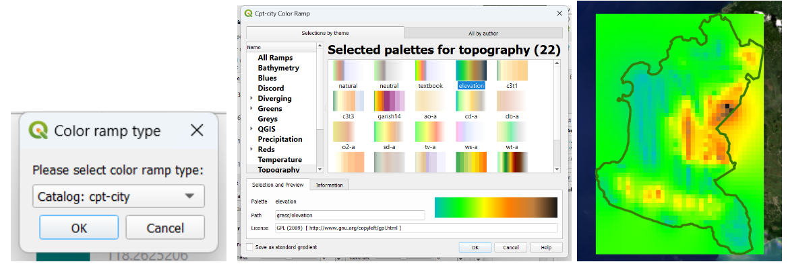

Now let’s work on creating a map from our layers. Let’s go to the Project menu. We need to set a ***New Print Layout***:

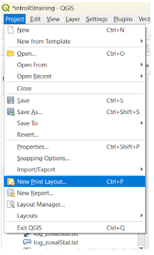

Then, within the ***Add Item*** menu, we use ***Add Map***:

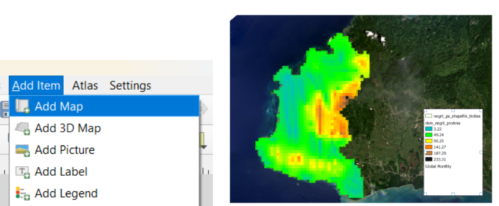

You need to include the basic elements for a formal cartographical production: legend, scale bar, north arrow, title. Make sure to provide an appropriate format and font for each item.

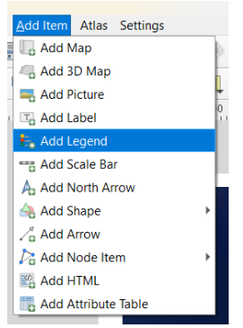

We finally got our map. We can use ‘Export Image’, choose the file type (png, jpeg, bmp, etc.) and save it in our work folder.

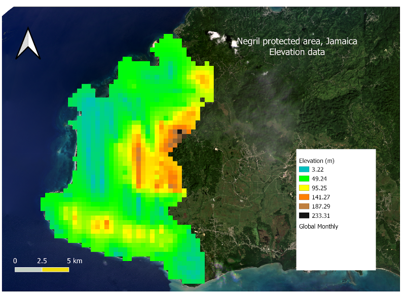

### Challenge 4: Create a hillshade layer

Based on the last DEM that we just created, create a hillshade map and then create a map with all the elements required.

*Hint: Use the HillShade tool from Raster menú -> Analysis/Terrain Analysis*.

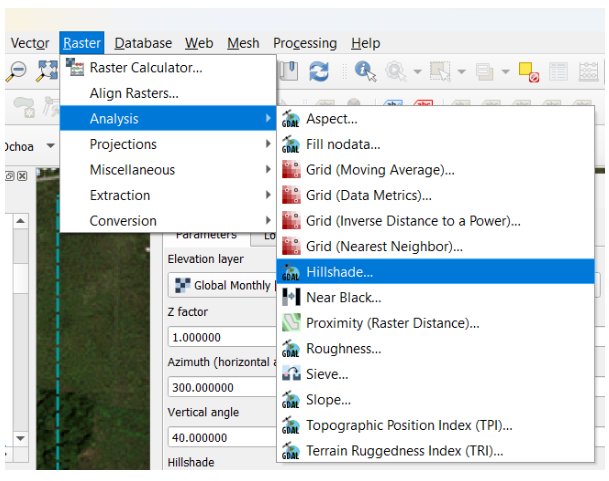
