# Challenges Solutions: Introduction to Remote Sensing

## Challenge 1: Quantify Landsat 8-derived NDVI

Visual inspection is helpful for telling a story with data, but numbers can tell a story too. Use QGIS to find the mean and median NDVI value inside the Negril Environmental Protected Area and in the non-protected areas of western Jamaica. Compare the values to see if there is a difference in vegetation levels between protected and non-protected areas.

- *Hint 1: You will have to use the l8-sr-ndvi-negril-2022-09-16.tif, the negril_pa_shapefile.shp and the non_protectedArea_savanna.shp as two different layers in the project.*
- *Hint 2: Using the entire Jamaica boundary (jam_admbnda_adm0.shp), first clip the negril_pa_shapefile.shp in order to obtain the protected area only in land (without sea portion), and save the new shapefile as negril_pa_shapefile_NoSea.shp. Use this new shapefile to compare the NDVI values.*
- *Hint 3: The Zonal Statistics tool will come in handy in this exercise.  Look for the Processing ToolBox→ Raster Analysis → Zonal statistics tool. You will be able to specify the statistics that you want (mean, max, min, etc)... then the results will be added in the attribute table of the shapefile layer used.*

1. Clipping the protected area shapefile. We add the Jamaica boundary

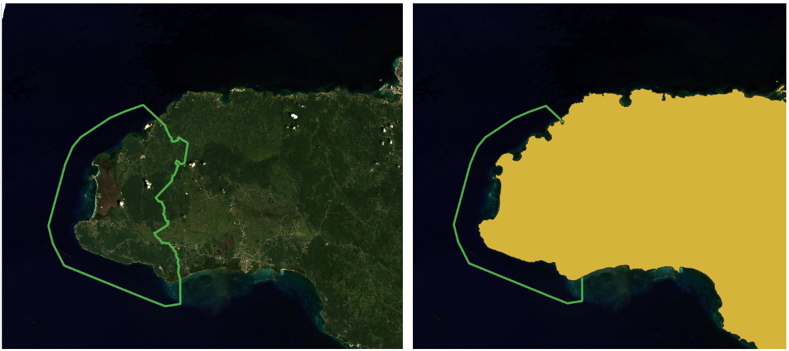

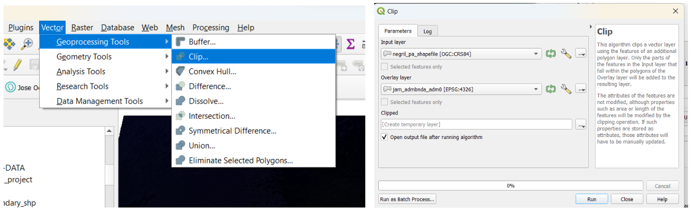

Lets save the new shapefile with the name *negril_pa_shapefile_NoSea.shp*.

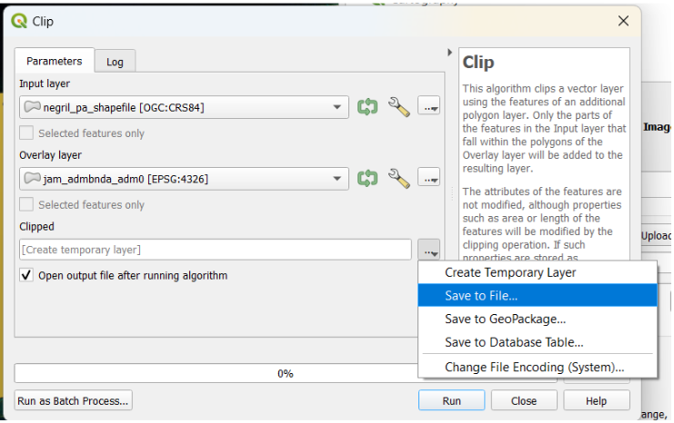

We finally obtained our protected area exclusively over land, without the sea portion.

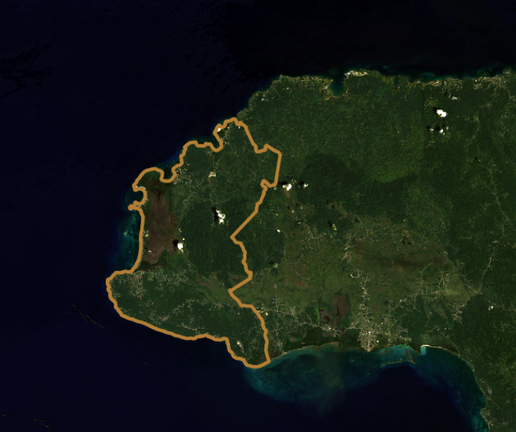

2. We load the *non_protectedArea_savanna.shp* and the NDVI raster layer *l8-sr-ndvi-negril-2022-09-16.tif*.

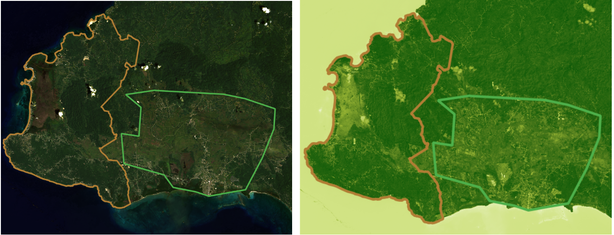

The range of values goes from -0.28 to 0.64 NDVI values.

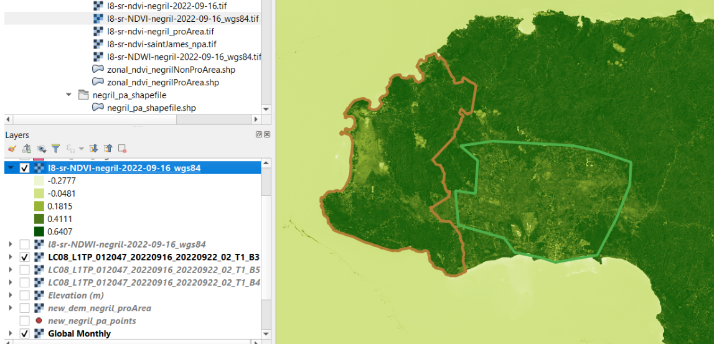

We use the Zonal Statistics tool from the Processing Tool box.

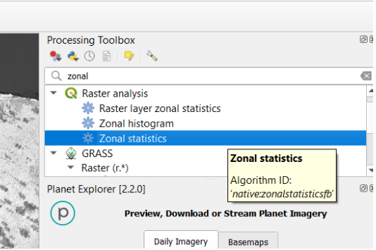

We select as input layer el shapefile corresponding to the specific zone where we want to compute the estimates.  

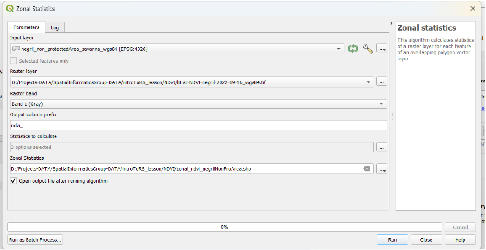

As a raster layer we select the general NDVI layer that compromises the entire territory of Jamaica. We set the prefix as “ndvi_”.  Later, we can choose the mean and median values to make a proper comparison between NDVI total estimates between protected versus non-protected areas.

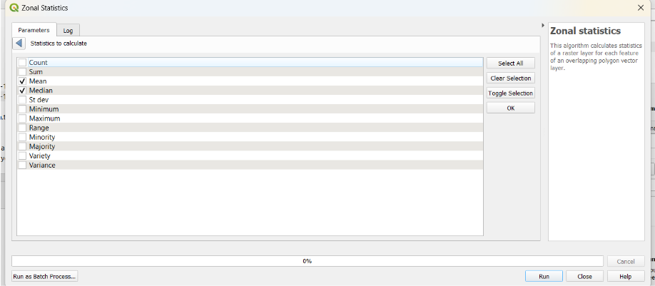

We define the new layer names as *zonal_ndvi_negrilProArea.shp* and *zonal_ndvi_negrilNonProArea.shp*. The results are added in the attribute table of the shapefile layer.  The following tables show the estimates for protected and non-protected areas mean and median NDVI values.

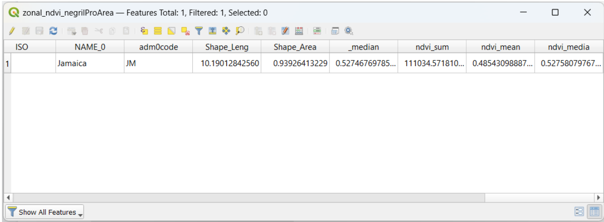

Protected area depicts a 0.49 mean and 0.53 median of NDVI.

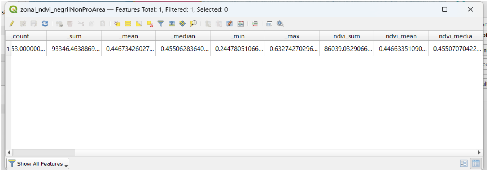

Non protected area (savanna) depicts a 0.45 mean and 0.46 median of NDVI. 

These values are lower as expected.  NDVI values in protected areas should be higher due to higher vegetation biomass and conservation policies for forested areas.

## Challenge 2: Calculator a Landsat 8-derived NDWI

The Normalized Difference Water Index (NDWI) is a well-known measure to estimate water content on the Earth Surface.  Use a similar process as we did for the NDVI exercise in order to obtain NDWI values.

NDWI can be calculated using the formula as follows: NDWI = (Band 3 – Band 5) / (Band 3 + Band 5) (McFeeters (1996))

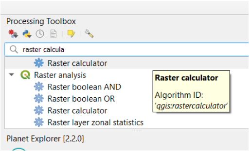

We choose the appropriate bands according to the formula

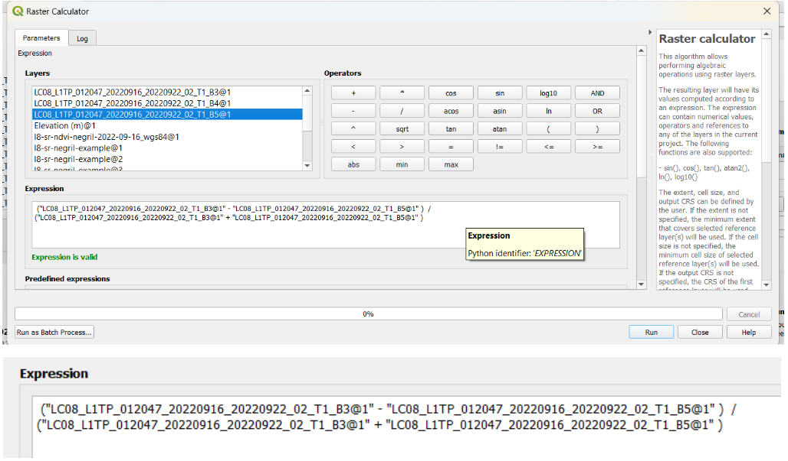

For the reference layer we choose B3 or B5. We save the new products as *l8-sr-NDWI-negril-2022-09-16_wgs84.tif*. Extent and output coordinate reference system (CRS) are set by the default values (Map Canvas extent).

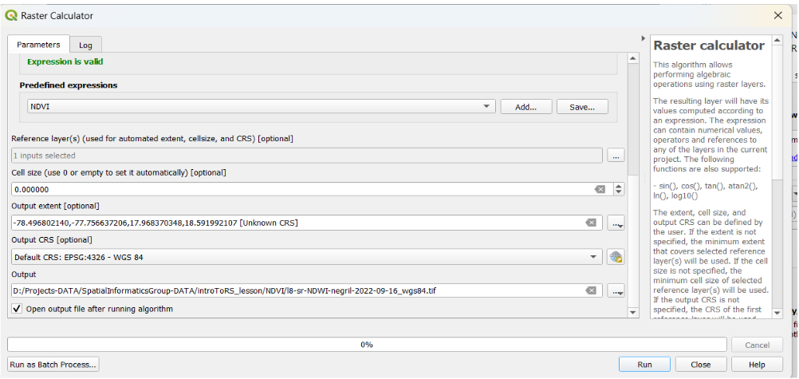

Our result is a [-1, 1] range raster layer that highlights water content. For example the ocean looks a more intense blue.

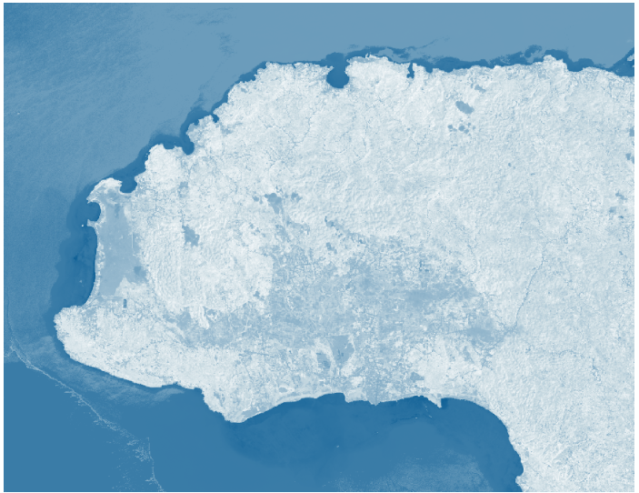

Wetlands will show up as blueish while bare land will look darker.

## Challenge 3: Quantify Sentinel-2-derived NDVI

Use QGIS to find the mean and median NDVI values inside the protected areas within Negril and in the non-protected areas of Negril. Compare the values to see if there is a difference in vegetation levels between protected and non-protected areas. Do these values differ from the values calculated in Challenge 1?

- *Hint 1: You will have to add the negril-pa-shapefile.zip and the **non_protectedArea_savanna.shp** as two different layers in the project.*
- *Hint 2: The Zonal Statistics tool will come in handy in this exercise.*  

We apply again the Zonal statistics function to both the protected and non-protected areas, this time with a Sentinel image at 10 m spatial resolution. Prefix ‘_ndvi’.

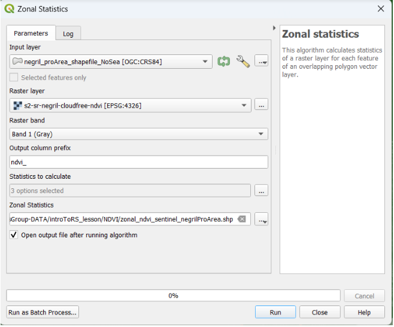

We save the new raster with the names *zonal_ndvi_sentinel_negrilProArea.shp* and  *zonal_ndvi_sentinel_nonProArea.shp*.

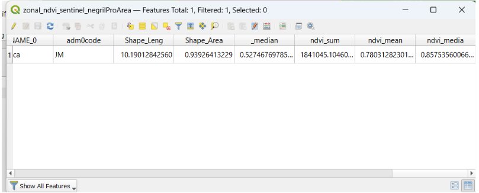

Again, NDVI values in the protected area are higher than in the non-protected area, as we expected. PA NDVI mean 0.78 while NPA NDVI mean is 0.71

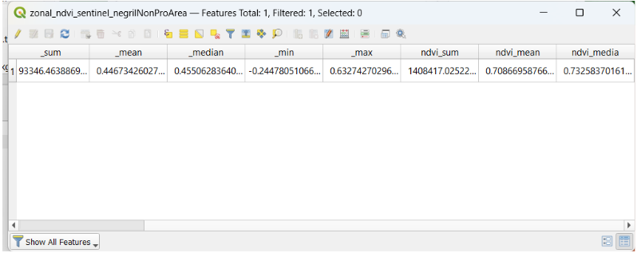

The difference between protected and non-protected area estimates is not large, however it still reveals the greater presence of vegetation in the Negril Environmental Protected Area.

## Challenge 4: Create a hillshade layer

Based on the last DEM that we just created, create a hillshade map and then create a map with all the elements required.
*Hint: Use the HillShade tool from Raster menu -> Analysis/Terrain Analysis*

We go to Analysis terrain, and use the Hillshade tool. 

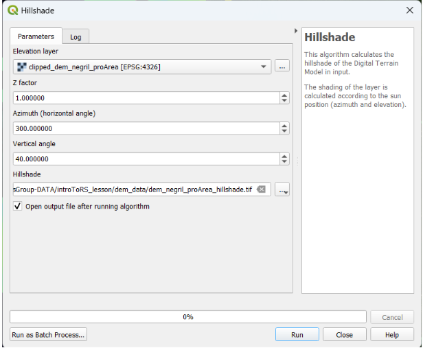

We can use the Z factor as 1, and the azimuth and zenith (vertical) angle by default (300° and 40° respectively). We define the name of the new file as dem_negril_proArea_hillshade.tif.

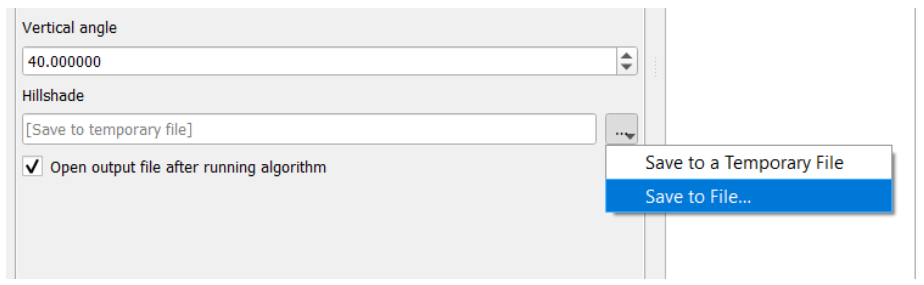

We obtain our hillshade layer. However it’s time to provide an appropriate symbology

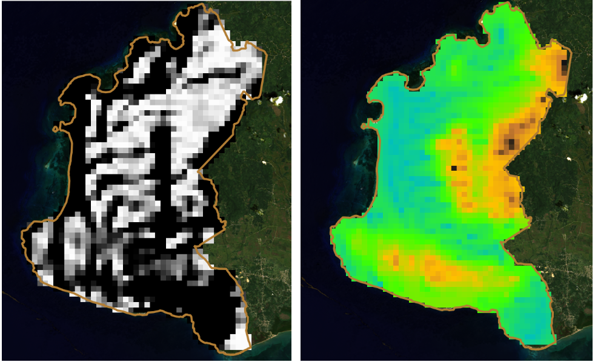

Let’s go to Symbology of the layer.

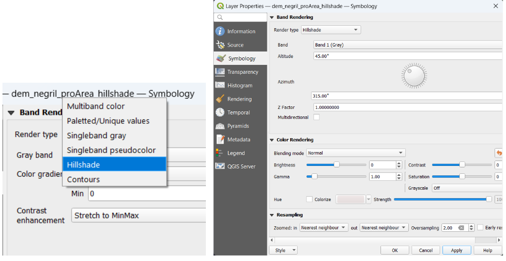

We apply this render type ‘Hillshade’. We use the visualization parameters by default.

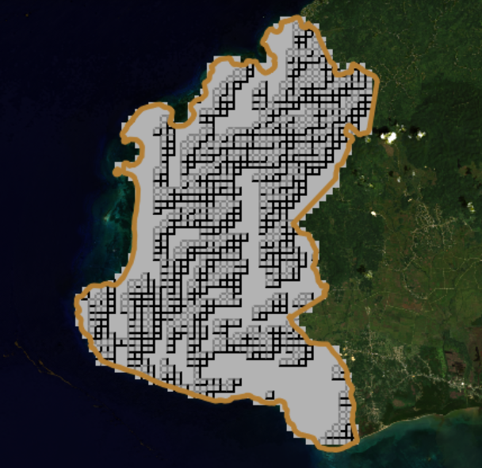

The hillshade layer looks pixelated.  This can be easily improved by increasing the number of height points collected.