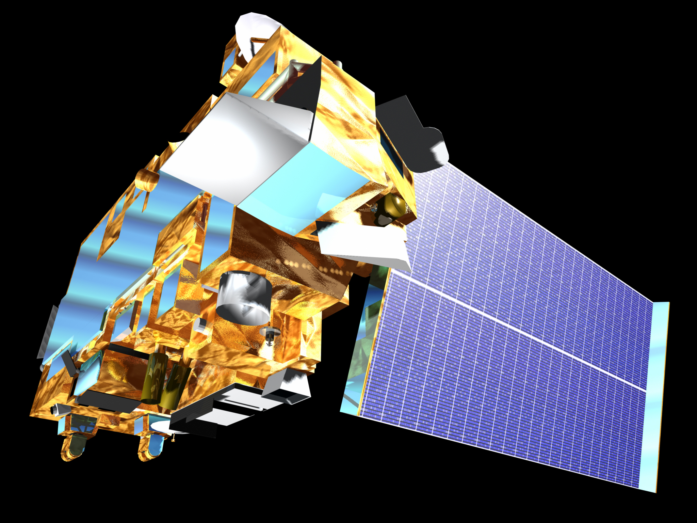

## QuickBird, RapidEye, SPOT quick overview: spectral discrimination, vegetation & water applications

QuickBird high resolution optical images are available as part of the Maxar Standard Satellite Imagery products from the QuickBird, WorldView-1/-2/-3/-4, and GeoEye-1 satellites. In particular, QuickBird offers archive panchromatic products up to 0.60 m GSD resolution and 4-Bands Multispectral products up to 2.4 m GSD resolution.  QuickBird's imaging capabilities have been applied in the industrial field, including oil and gas exploration and production (E&P), engineering and construction, environmental monitoring, among others.

On the other hand, RapidEye is a constellation of five identical satellites launched in August 2008 by Planet Labs. The constellation was deactivated in March 2020 but Planet still provides a data archive. It has 5 m spatial resolution, a global revisit time of 1-day, 5.5 days at nadir over mid-latitude regions (±84° latitude) and five bands : B, G, R, Red edge, NIR.

Finally the Satellite pour l'Observation de la Terre SPOT (Satellite for Earth Observation) is a series of high-resolution optical imaging satellites launched by the french company SPOT Image. The latest SPOT-6 and SPOT-7 satellites provide 6 m multispectral resolution plus 1.5 m panchromatic and color merge of 1.5 m.


## High spectral resolution: MODIS
The Moderate Resolution Imaging Spectroradiometer (MODIS) instrument is operating on both the Terra and Aqua spacecraft. The Terra satellite was launched on December 18, 1999 and the Aqua on May 4, 2002. It has a viewing swath width of 2,330 km and views the entire surface of the Earth every one to two days. Its detectors measure 36 spectral bands and it acquires data at three spatial resolutions: 250 m, 500 m, and 1,000 m.



Terra satellite carrying MODIS instrument. Source: USGS EarthData

https://lpdaac.usgs.gov/data/get-started-data/collection-overview/missions/modis-overview/

```javascript
var dataset = ee.ImageCollection('MODIS/061/MOD09GQ')
                  .filter(ee.Filter.date('2018-01-01', '2018-05-01'));
var falseColorVis = {
  min: -100.0,
  max: 8000.0,
  bands: ['sur_refl_b02', 'sur_refl_b02', 'sur_refl_b01'],
};
Map.setCenter(6.746, 46.529, 2);
Map.addLayer(dataset, falseColorVis, 'False Color');
```
For Aqua satellite the code is:

```javascript 
var dataset = ee.ImageCollection('MODIS/061/MYD09GQ')
                  .filter(ee.Filter.date('2018-01-01', '2018-05-01'));
var falseColorVis = {
  min: -100.0,
  max: 8000.0,
  bands: ['sur_refl_b02', 'sur_refl_b02', 'sur_refl_b01'],
};
Map.setCenter(6.746, 46.529, 2);
Map.addLayer(dataset, falseColorVis, 'False Color');
```

### Challenge 1: Working with high resolution derived water indexes
Create a NDWI index using the NICFI tropical Americas dataset from Planet in Google Earth Engine for January  2023 for the capital of Guyana, Georgetown. 

*Hint 1:* Use a similar approach as it is shown for the NDVI calculation. 
*Hin 2:* Make use of the Cloud-Based Remote Sensing with Google Earth Engine: Fundamentals and Applications book (https://eefabook.org) to find help 


### Challenge 2: Researching about SPOT satellite
Develop a short research about the SPOT and its main advantages for vegetation cover analysis.


### Recommended resources:

The first Google Earth Engine textbook free: https://eefabook.org
Feedback: https://docs.google.com/forms/d/e/1FAIpQLSdk81jKgzDMyEFm3y5FdaiB7oTz5rzJ-rF6elyA_bUECLL2Ww/viewform  
Guyana Main Website: Direct Link: https://docs.google.com/document/d/1_Aj1cHkljhWwpq-vmxET9FRRHVpEmhfajlZ1kp4m2cM/edit?usp=sharing 