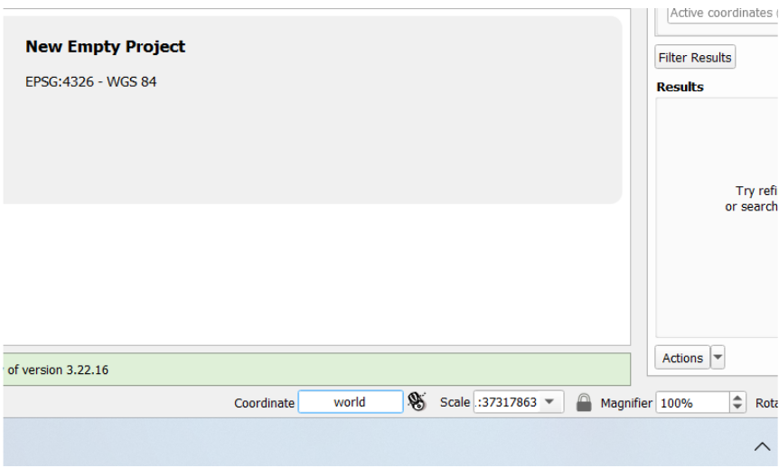
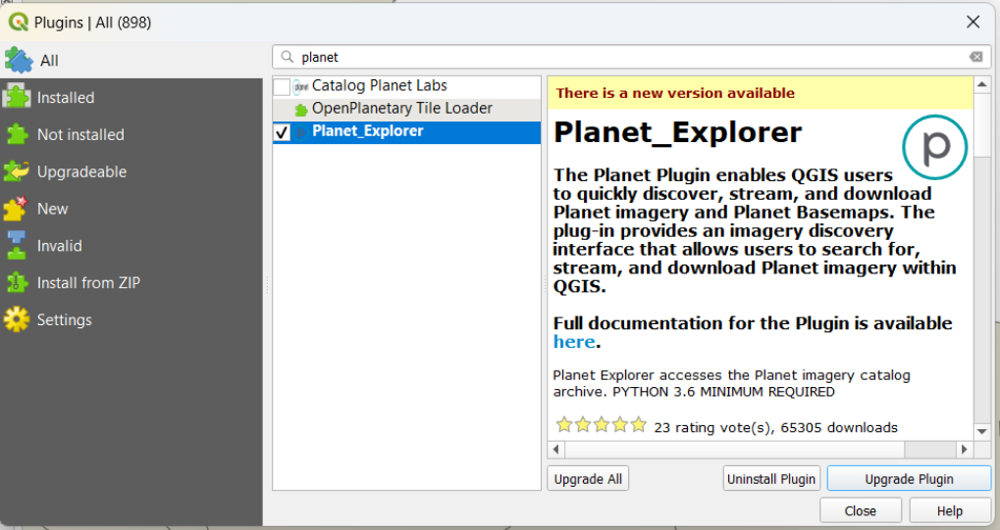
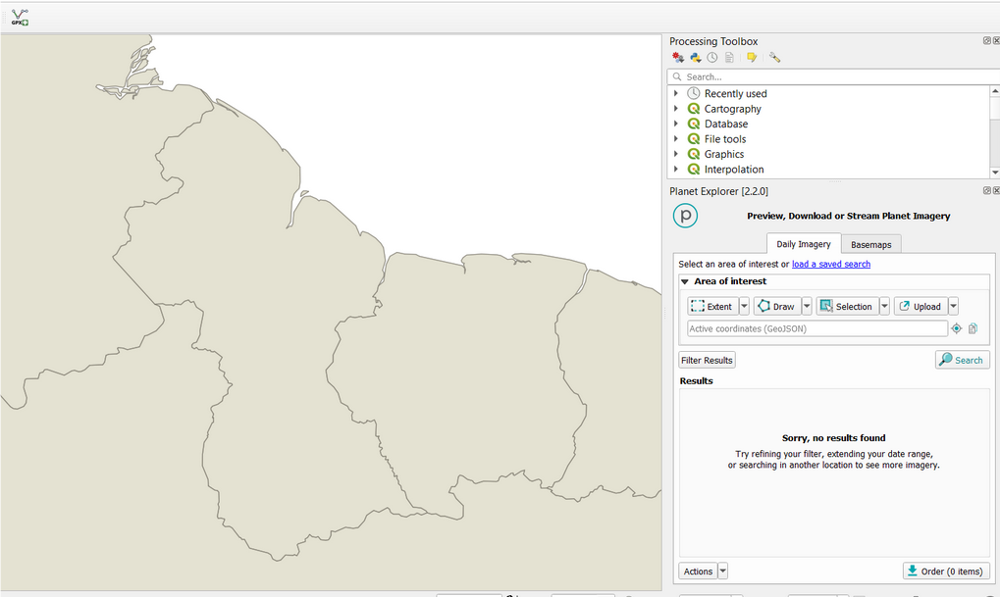
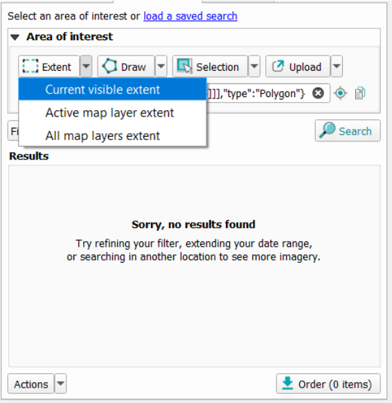
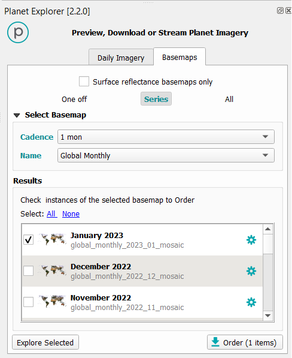
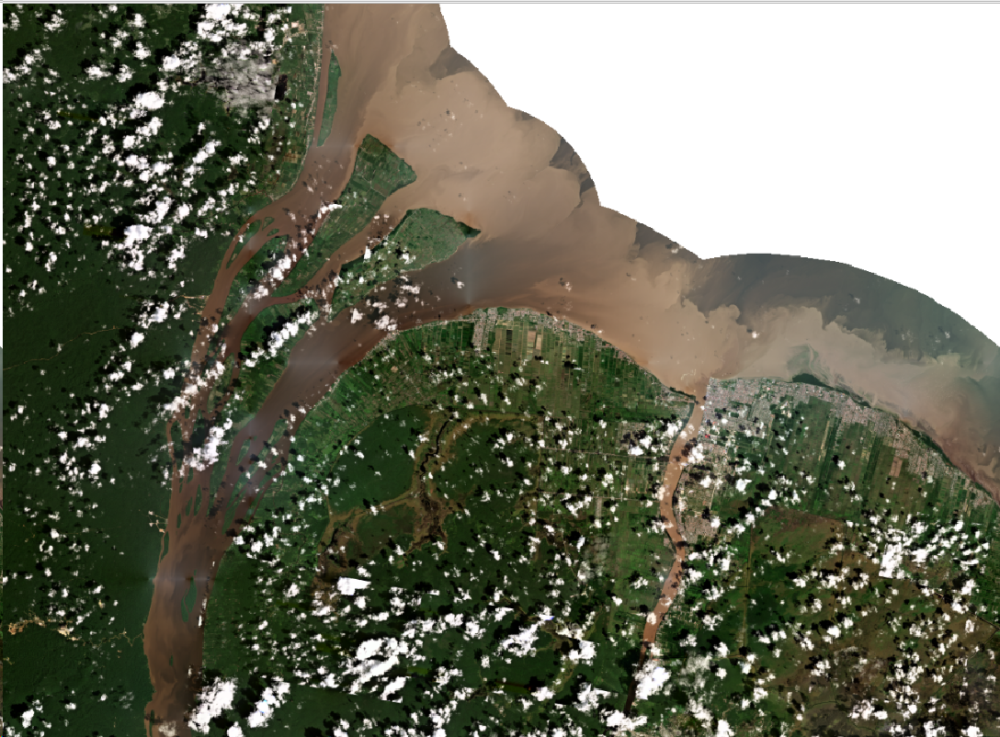
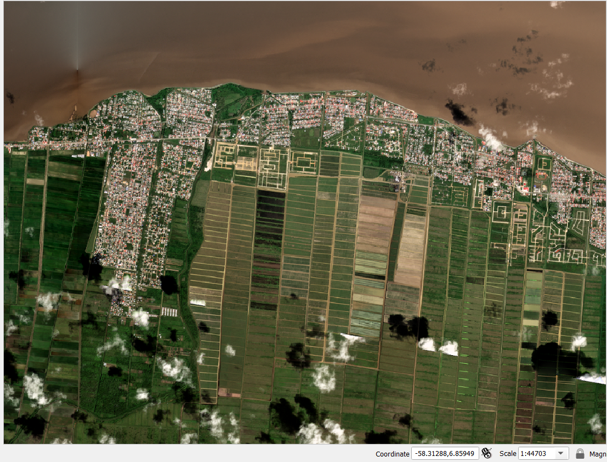
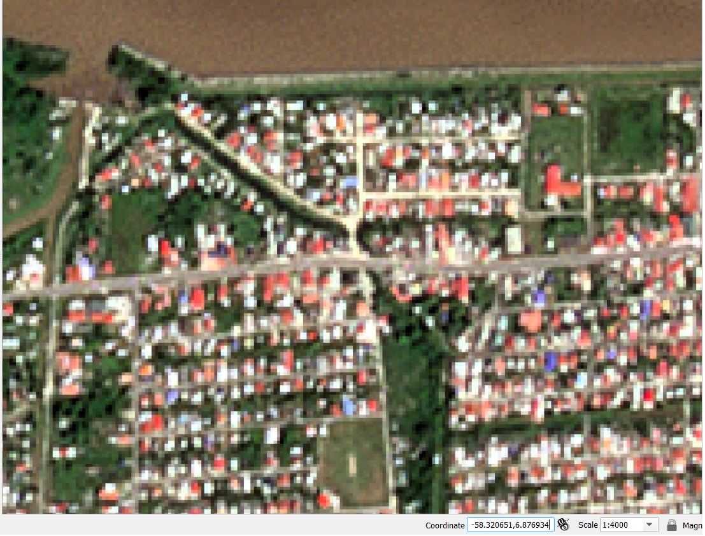
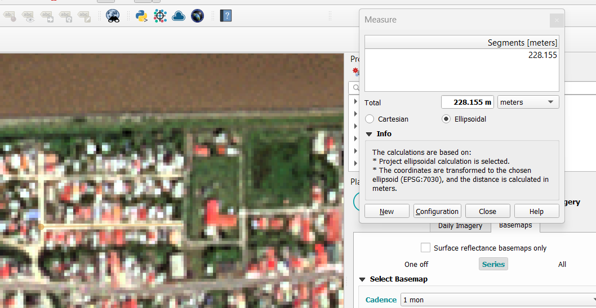
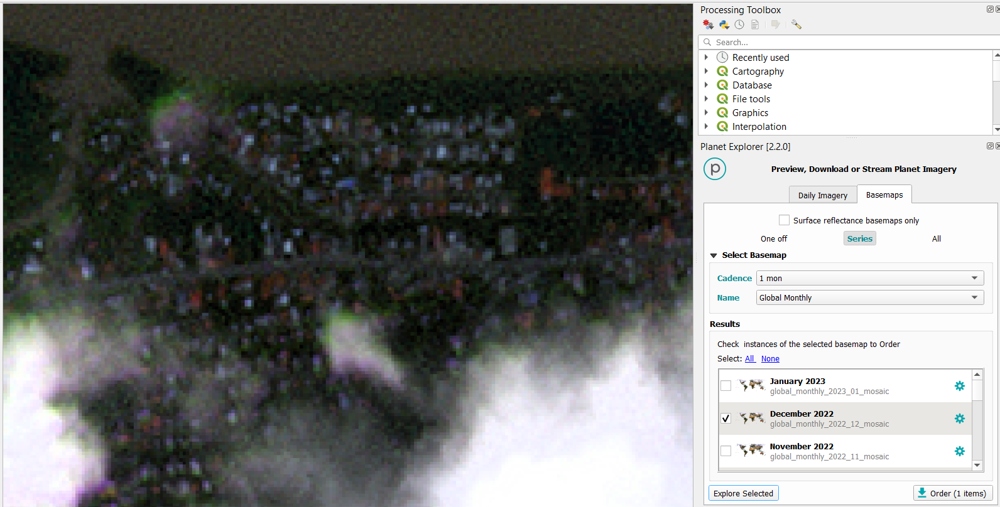

## Exercise 1: Working with QGIS : Planet Explorer plugin
In this exercise we will make use of the existent connection available between QGIS software and Planet catalog. We will explore the potential of high resolution products over traditional data. Let’s create a new folder for today's training and save the new project as ‘planet’.

In the Coordinate field, let’s type the word ‘World’ and press enter.

Figure 16. Coordinate textbox.

Next, let’s install the Planet Explorer plugin by going to looking for the words ‘Planet_Explorer’ in the search bar

**Figure 17.** Planet Explorer plugin

This plugin allows you to quickly discover and download Planet high resolution imagery. A small Planet panel will show up on the right side of your screen. You will need to provide your username and password to log in. 

**Figure 18.** Planet plugin overview within QGIS environment.

Make sure to zoom over Guyana country, into the capital of Georgetown.

**Figure 19.** Planet explorer parametrization

Since we do not have a commercial Planet account with a paid plan for daily imagery access, we will see a temporal message indicating “Sorry, no results found” for the daily images.  However we can make use of the pool of basemaps available.  Let’s click on the ‘Basemaps’ tab and select the following values: Cadence of 1-month, Global Monthly or PS Tropical Visual Monthly Monitoring product, the latest layer of January 2023.

**Figure 20**

Hit the button ‘Explore Selected’ and the mosaic will be added in the map viewer window and in the Layers section.

Using a scale of 1:44703 we can visualize a lot of interesting details on the coast of the capital, for example, the arrangement of city blocks, crop fields, parks, etc. Let’s remember the scale indicates how many centimeters on the ground (44703 cm or 447 m ) are represented in 1 cm of the visible map. Now let’s use those parameters to visualize the urban area in more detail.  Let’s define a scale of 1 cm per 40 meters (1:4000) in the location with coordinates longitude -58.32, + 6.88 latitude (copy and paste -58.324232, 6.880042).

You should have a similar view than Figure . We can identify city blocks, roads, and houses. Now let’s use the rule tool to measure a block size.  

When measuring we found the length of a block of 228 m (or 228/40m = ~5 cm in the map). We can get an idea of the spatial dimension for a 3m-pixel size from Planet data.

Now let’s explore other products from different months.  It’s expected to find more or less cloudy products depending on the seasonality of the place.  For example, December looks very cloudy and a poor-quality image for the Georgetown area.

We need to rename each layer we add since the layers will have at first the same name, depending of its type, e.g. ‘Global monthly’. We can also use the 3-monthly products.  Let’s change the Cadence value into 3 mons, and the name of the category into Global Quarterly 

