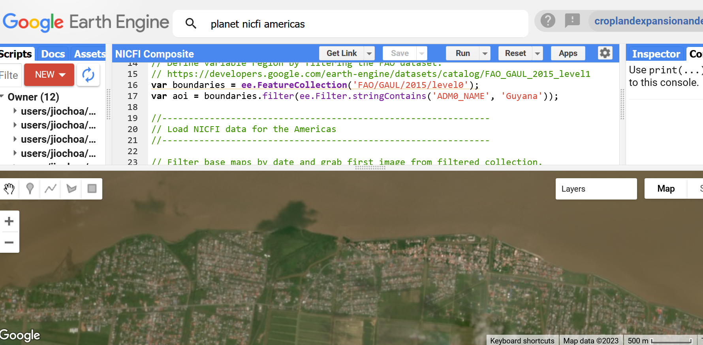
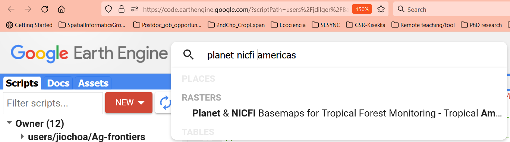
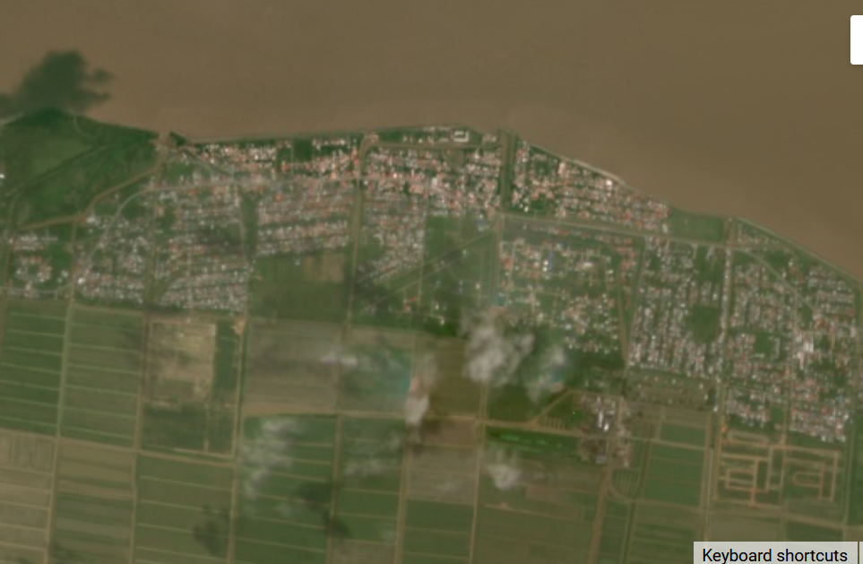
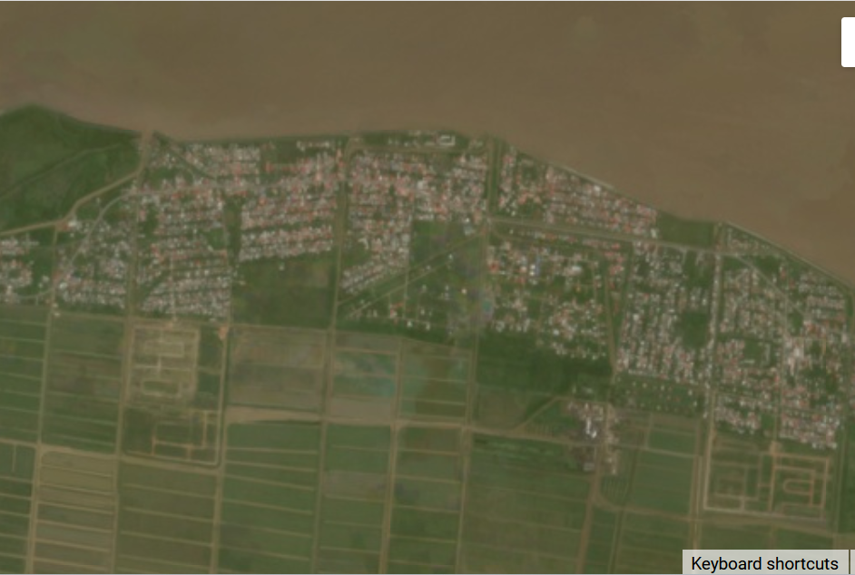

## Exercise 2: Working on Google Earth Engine (GEE) with Planet imagery

### Retrieving and analyzing global tropical regions data into GEE: NICFI access for Planet

The main objective of the NICFI Program is to provide support to reduce and reverse the loss of tropical forests, contribute to combating climate change, conserve biodiversity, contribute to the growth, restoration and improvement of forests, and facilitate sustainable development, all for non-commercial purposes.

The available NICFI Planet datasets we have are:

**Basemaps**
● Hosted directly on the GEE so you can access the basemap as you would any other open source data
● Currently, only analytical basemaps are available
● Organized into 3 regional image collections: America, Africa and Asia
● Source scenes for basemaps are not available in GEE
● There are 3 steps:
    ○ Have a GEE account
    ○ Sign Planet NICFI Terms and Conditions
    ○ Request access to NICFI basemaps on the GEE

**Daily imagery**
● Works with Order API, i.e. not hosted by GEE
● Only PSScene4Band and PSOrthoTiles are available for download on GEE
● Currently, only clipping is supported.
● There are 3 steps:
    ○ Have a GEE account integrated with Google Cloud Platform (GCP)
    ○ Create a GCP and enable the Google Earth Engine API
    ○ Give a Planet service account an EE resource writer role on GCP

Now we are going to create and visualize NICFI composites.  First let’s go to the Google Earth Engine (GEE) code environment (https://code.earthengine.google.com/) , login and create a new script as we did in the previous workshop. You can use the same repository that you already created. You can find the entire code to follow in this script link:

https://code.earthengine.google.com/252398e06c93fd18c6288ce9bee8f236

First, let’s type the words ‘planet nicfi americas’ and click on the first result:

We can read the description, characteristics and band properties of the NICFI basemaps available in GEE:

NICFI mosaics have a spatial resolution of ~5 m (4.77 m) and include the following spectral properties: 

<table>
  <tbody>
    <tr>
      <th align="center">Name</th>
      <th align="center">Description</th>
      <th align="center">Min</th>
      <th align="center">Max</th>
      <th align="center">Scale</th>
    </tr>
    <tr>
      <td>B</td>
      <td>Blue</td>
      <td>0</td>
      <td>10000</td>
      <td>0.0001</td>
    </tr>
    <tr>
      <td>G</td>
      <td>Green</td>
      <td>0</td>
      <td>10000</td>
      <td>0.0001</td>
    </tr>
    <tr>
      <td>R</td>
      <td>Red</td>
      <td>0</td>
      <td>10000</td>
      <td>0.0001</td>
    </tr>
    <tr>
      <td>NIR</td>
      <td>Near Infrared</td>
      <td>0</td>
      <td>10000</td>
      <td>0.0001</td>
    </tr>  </tbody>
</table>

The scale value means that the surface reflectance has been multiplied per 10000. The first step is to select of area of study (AOI)  

var boundaries = ee.FeatureCollection('FAO/GAUL/2015/level0');
var aoi = boundaries.filter(ee.Filter.stringContains('ADM0_NAME', 'Guyana'));

Next, we filter the imported image collection into a specific month we want to look at.  We choose January 2022.

//--------------------------------------------------------------
// Load NICFI data for the Americas
//--------------------------------------------------------------

// Filter base maps by date and grab first image from filtered collection.
var basemap = nicfi.filter(ee.Filter.date('2022-01-01','2022-02-01')).first();

Finally, we add the NICIF basemap layer to the GEE visor:

// Center the map.
var gt = ee.Geometry.Point(-58.324232, 6.880042)
Map.centerObject(gt, 14);

// Define visualization parameters
var vis = {'bands': ['R', 'G', 'B'], 'min': 64, 'max': 5454, 'gamma': 1.8};

// Add filtered basemap to the map.
Map.addLayer(basemap, vis, 'Mosaic 07-2021');

We derive a NDVI layer by computing the traditional mathematical formula.  We add our new NDVI band to the basemap dataset.

// Add basemap NDVI.
var ndvi = basemap.normalizedDifference(['N','R']).rename('NDVI');
var basemap = basemap.addBands(ndvi);
Map.addLayer(
	basemap,
	{bands: ['NDVI'], min: -0.55, max: 0.8, palette: [
    	'8bc4f9', 'c9995c', 'c7d270','8add60','097210'
	]}, 'NDVI', false);

Now let’s improve our composite by retrieving a larger set of images in time

// Looks a little cloudy... try changing the date filter.
// Map NDVI function to entire collection.
var nicfi = nicfi.map(function(img){
  var ndvi = img.normalizedDifference(['N','R']).rename('NDVI');
  return img.addBands(ndvi);
});

// Create a composite of mosaics from 2022-01 to 2022-06.
var composite = nicfi.filter(ee.Filter.date('2022-01-01','2022-06-01')).median();
Map.addLayer(composite,vis,'improved composite', true);

Make a comparison between the first composite and the filtered one, both showed in a true color display setting:

  

We can observe how the clouds were removed in the second image.