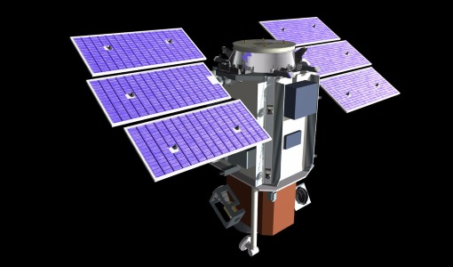
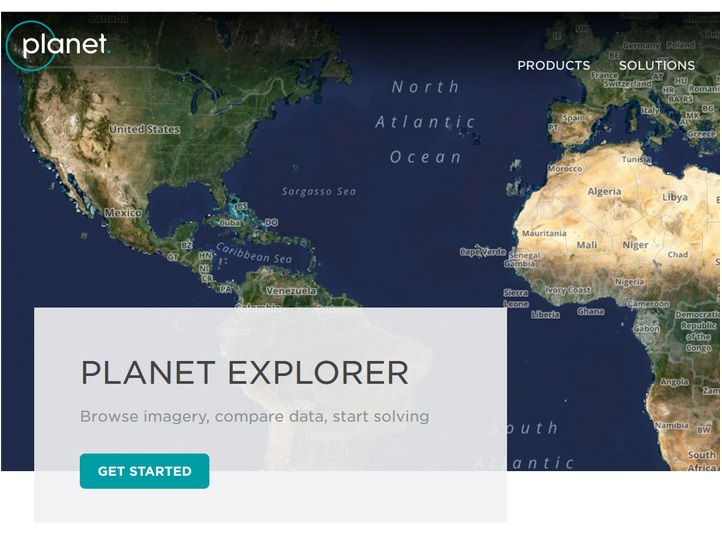
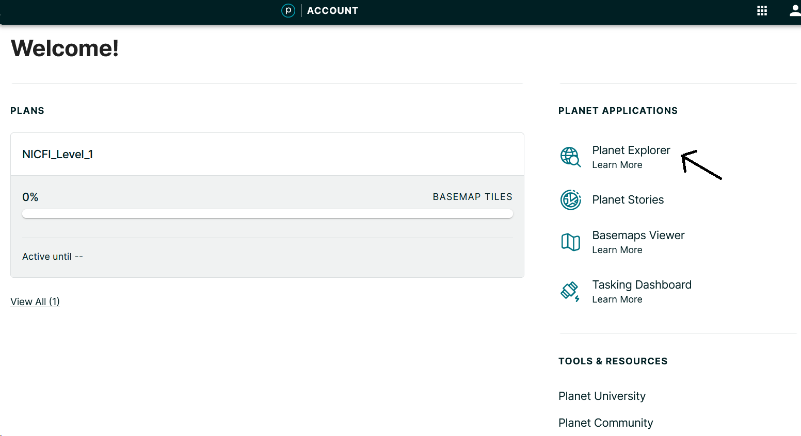
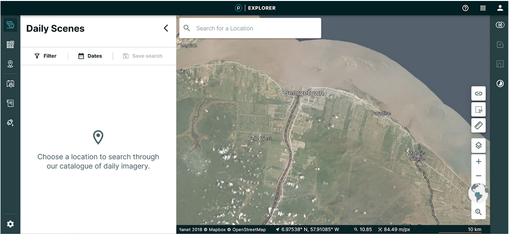
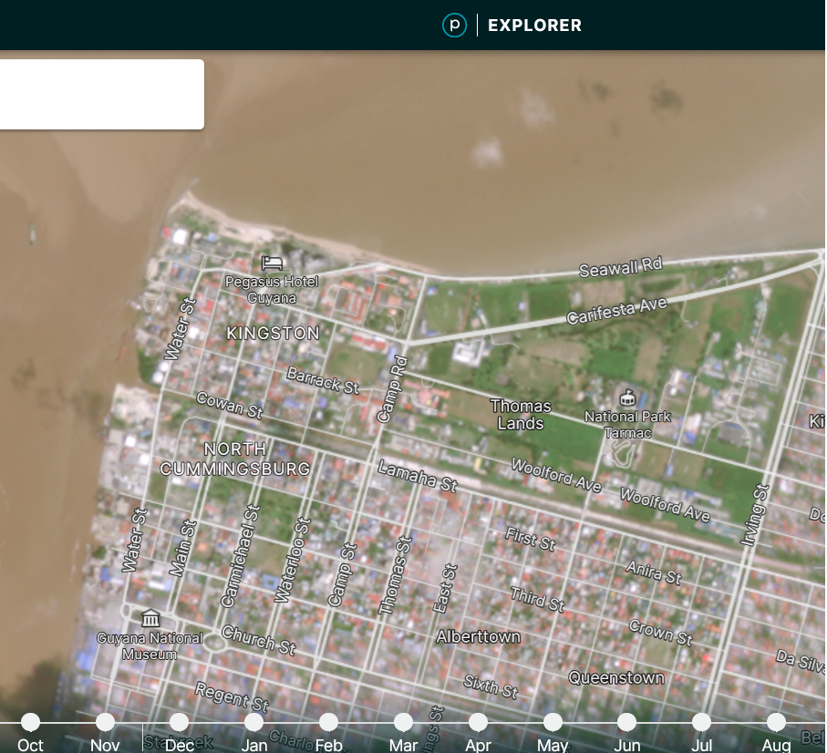
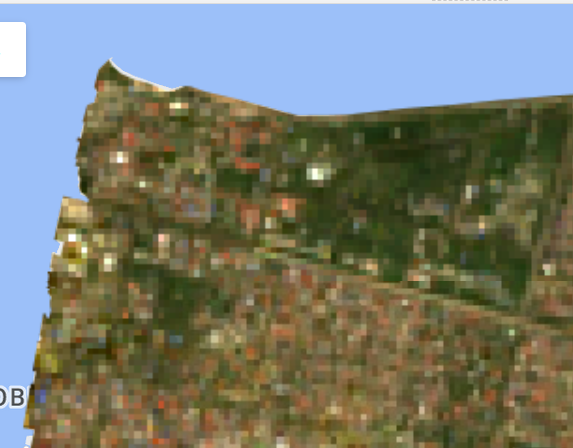

# Fundamentals

High resolution satellite imagery corresponds to those satellite or airborne-transported sensor products with high capabilities in terms of the spatial dimension mainly, but also in the spectral and temporal (revisit cycles) domains.  High spatial resolution products for example provide outstanding details of the Earth’s land cover offering the opportunity to identify objects and figures that are not visible with traditional satellite data. 

Figure 9. The QuickBird-2 satellite. Source: The European Space Agency (ESA), earth.esa.int

The smaller the pixel size, the sharper the image, simple like that. High-resolution satellite products track the constant and shifting human footprint across the globe, by helping us to monitor urban sprawl, land cover change and informal settlements at in-deep detail.

High spatial resolution imagery: Planet data exploration

As an example to follow, we will be using Planet Labs datasets :
https://www.planet.com/products/explorer/

**Figure 10**. Planet web domain.

**Figure 11**. Planet explorer link.

**Figure 12**. Planet explorer platform

In the right panel we have different tools that allow you to create or upload a geometry. A geometry defines your area of interest and it is required to search Planet’s daily scene catalog.

**Figure 13.** How a Planet scene looks.

You can use the GEE script link from the previous workshop to have a look at Landsat data (https://code.earthengine.google.com/ca5031e1dc28543143fb723deb95c4a0)

**Figure 14.** 30-m Landsat mosaic 

While comparing monthly Planet 4.6m mosaic with a Landsat 30m composite we can find important differences in terms of spatial resolution. In the Planet image we are able to identify different objects such as grass fields, houses, trees, crops, etc.  On the other hand, with the Landsat image is almost impossible to recognize any of those objects

## Private/commercial versus governmental/open-free datasets
High and very high resolution satellite products usually are offered commercially by space technology private companies. Maxar Technologies with DigitalGlobe and Planet Labs with RapidEye, SkySat and Dove, are good examples of private high resolution optical and radar products. For reference, the synthetic aperture radar (SAR) RADARSAT-2 data is provided up to 0.25 m, while Planet optical data area available in a range of pixel-sizes from 3m to 0.5 m approximately.