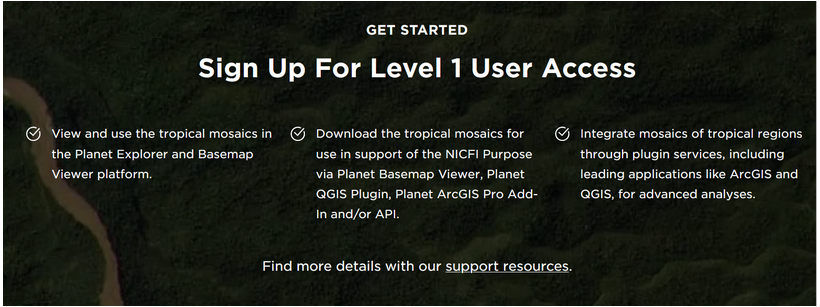

# Introduction

Welcome to the Remote Sensing with High Resolution imagery training!.  This workshop will give you an overview of the different sources and datasets available of high resolution satellite imagery, their main features, advantages over moderate-low resolution data, and available sources.

## Objectives
1. Getting familiar with the fundamentals and capabilities of high resolution satellite imagery.
2. Understanding the main differences and advantages between high resolution datasets and moderate to low resolution traditional data.
3. Exploring the different high resolution products sources available, either from the private or governmental sector.
4. Getting familiar with tools to access these data.

## Pre-workshop Set-up
1. You need to create a Planet Labs account through the NICFI program. Please go to the website: and create an account.
 https://www.planet.com/nicfi/#sign-up
2. Having internet connection and your GEE account ready

