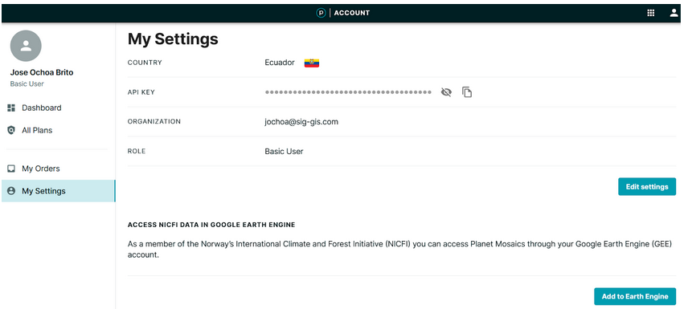

# Introduction

Welcome to the Remote Sensing with High Resolution imagery training!.  This workshop will give you an overview of the different sources and datasets available of high resolution satellite imagery, their main features, advantages over moderate-low resolution data, and available sources.

## Objectives
1. Getting familiar with the fundamentals and capabilities of high resolution satellite imagery.
2. Understanding the main differences and advantages between high resolution datasets and moderate to low resolution traditional data.
3. Exploring the different high resolution products sources available, either from the private or governmental sector.
4. Getting familiar with tools to access these data.

## Pre-workshop Set-up
1. You need to create a Planet Labs account through the NICFI program. Please go to the website: and create an account.
 https://www.planet.com/nicfi/#sign-up
2. Having internet connection and your GEE account ready

Figure 1. Planet Labs sign up interface.

Go to the lower area of the website and you will find the sign-up form.

Figure 2. Signing up form

Once you have signed up, you need to follow the activation link that arrived to your email inbox.  Then complete a few additional data

Figure 3. Creating an account.

You can select the level of expertise and provide the purpose of data use.

Figure 4. Choose some user parameters.

Finally you need to accept the policies and license agreement and hit the ‘submit’ button.

Figure 5. Terms of Service

In addition, you will need to have your GEE account approved. We did this step in our previous workshop. You can always go to the GEE website and sign up for a new user account: https://earthengine.google.com/signup. 

Go to the https://www.planet.com/ and log in with your user name. Now you will access the Planet portal for your personal account and take a look of the different options you have, specially in the right panel titled ‘Planet Applications’. 

Figure 6. Planer account interface

Go to the My Settings section and enable the access to NICFI DaTa in Google Earth Engine (GEE) with the ‘Add to Earth Engine’ button.

Figure 7. My Settings section.

Make sure to select all the tropical zone mosaics.

Figure 8. NICFI data choices.
 
You will see a message of ‘Integration established’ and you are all set to go.

