## Exercise 1: Mapping surface water using SAR data with QGIS
We are going to use the image we obtained from our previous training (Intro to Radar), the water_nonwater.tif  raster product. In that exercise we collected the SAR Sentinel-1 image from January 2023 in a location in the Brazilian Amazon basin. We will be working in the same location and we will retrieve and pre-process a SAR image but this time from October 2021, because October is considered a rainy month, while January corresponds to a dry season. The objective is to evaluate the capacity of SAR data to map flood surface water using a multi-temporal approach by comparing both dates and tracking differences in the river flow and potential floods.
First, let’s access https://vertex.daac.asf.alaska.edu to download our new radar (SAR Sentinel-1) image. We have to specify October 2021 as our temporal filter.

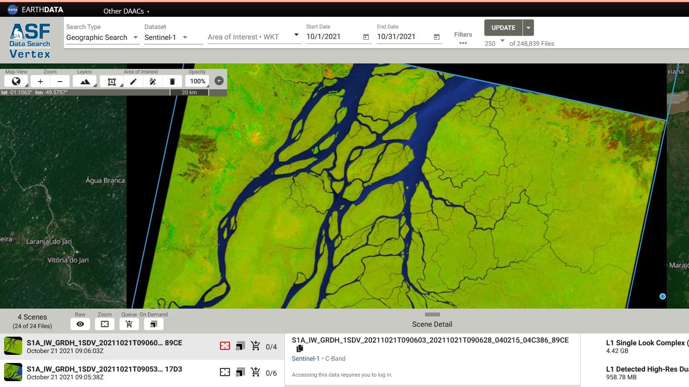

**Figure 4.** Vertex platform

Under the Area of Interest field, input POLYGON((-50.985 -0.8565,-50.0179 -0.8565,-50.0179 0.0347,-50.985 0.0347,-50.985 -0.8565)), and click Search. Select the first image result. Feel free to explore the other images the search returned by scrolling through the results.  Then you can press in the ‘Add scene files to downloads’ button, or just click on the ‘L1 Detected High-Res Dual-Pol (GRD-HD)’ product download, the one that we need. Create a new folder in your computer called ‘qgis_flood_tt’ to save our new files and the following QGIS new project.

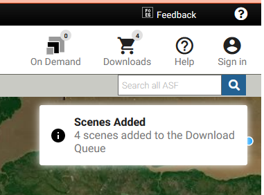 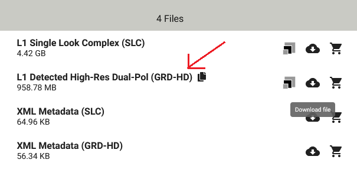

**Figure 5.** Products added in the queue

Now we need to process our new SAR file, following the same steps as we learnt from our previous training. We need to open the SNAP software in our computers and open the zipped file we just downloaded.

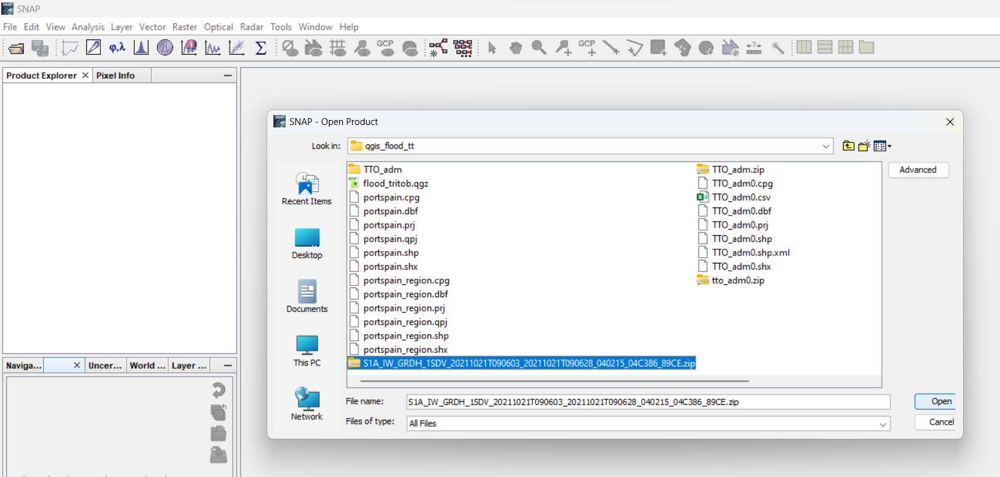

**Figure 6.** Adding the SAR file

Let’s take a look at our file added, and its structure and the four components, amplitude and phase for two polarizations.

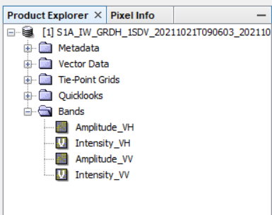

**Figure 7.** The four polarization bands present in the SAR product.

Add the Amplitude_VV component in the image viewer by double clicking it, and zoom in at different angles and locations.  Examine the heterogeneity of the pixels. Observe how there is such a favorable visual difference between water and non-water areas. What causes this?

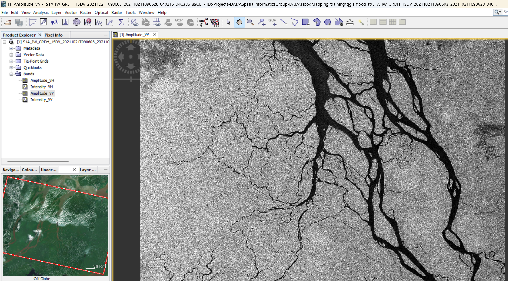

**Figure 8.** Visualization of the amplitude (strength of signal) Vertical-Vertical (VV) band.

&nbsp;

### Create a subset ###
Your next step will be to create a subset of this image in order to reduce file size and save some computer processing time. 

1. In the upper menu bar, select `Raster > Subset…`.
2. Set the following parameters:
> Scene start X: 8775  
> Scene start Y: 2230  
> Scene end X: 23315  
> Scene end Y: 14930
3. Click OK.

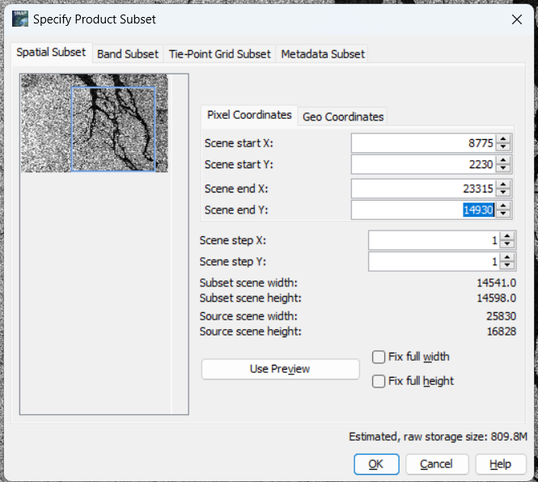

**Figure 9.** Subset
Return to the Product Explorer panel. You should see a new file listed that looks like subset_0_of_[FILE NAME]. Expand the Bands folder, and double-click on Amplitude_VV to add the subset to the image viewer. Feel free to close the previous images we opened in the viewer to keep things organized.

&nbsp;

### Perform radiometric calibration ###
1. Click on the subset filename in the Product Explorer window to highlight the file.
In the upper menu bar, select `Radar > Radiometric > Calibrate`. 

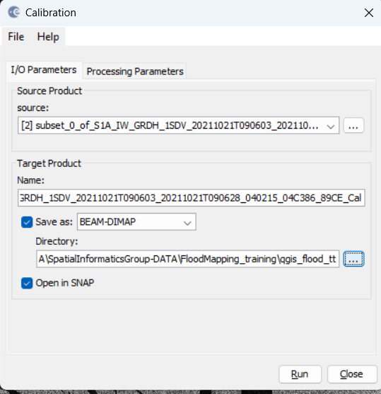

**Figure 10.** Image calibration
    
2.  Leave all of the default options as is, except for the directory. Set the directory as your qgis_flood_tt folder.

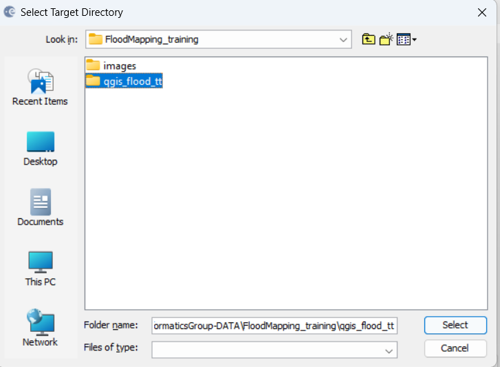

**Figure 11.** Setting the directory

3. Click Run. It may take a few seconds for the calibration to complete depending on the speed of your computer.

4. Once the process has completed, click Close. Then you should see a new file listed under the Product Explorer window – this is the calibrated image.

5. Expand the new image file and add the Sigma0_VV band to the image viewer. This image should appear somewhat darker, as there have been multiple corrections made due to antennae pattern, signal strength, saturation, etc.

### Reduce speckle ### 
To filter out the image speckling, we will use a technique called multilook. Multilook divides the radar beam into a number of “sub-beams”, each of which are a single “look” at the scene. The “looks” are summed and averaged together which will reduce the amount of speckle in the final image.
1. In the upper menu bar, go to `Radar > SAR Utilities > Multilooking`.
2. In the pop-up window, click on the Processing Parameters tab. Set the Number of Range Looks to 6. 
3. Then, under the I/O Parameters tab, make sure the directory is set to your qgis_flood_tt folder.
4. Click Run.
5. Click Close. Another new file should appear in the Product Explorer window.
6. Add the Sigma0_VV band to the image viewer. There is a big improvement between the original image and the new image!

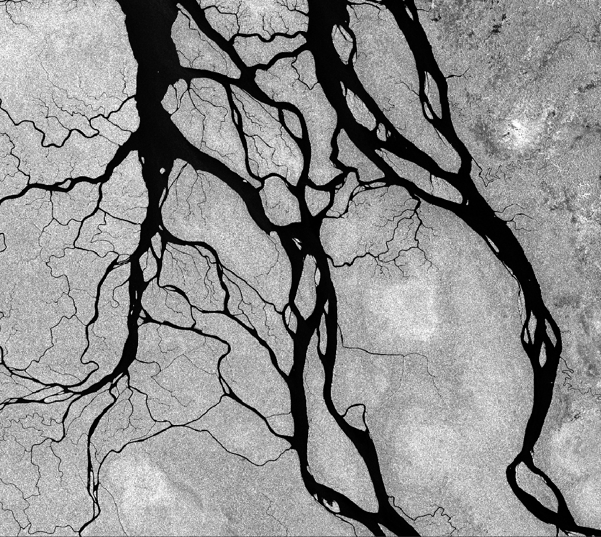

**Figure 11b.** Reducing speckle

### Perform geometric calibration ###
Although these images have already been adjusted to ground range rather than slant range, we still need to adjust for any displacement due to terrain.
1. In the upper menu bar, go to `Radar > Geometric > Terrain Correction > Range-Doppler Terrain Correction`.
2. Note that this process relies on a digital elevation model (DEM) to make the corrections. You may customize the DEM by clicking on the Processing Parameters and selecting any of the options in the Digital Elevation Model drop-down menu, or using your own if you have one. We will be sticking with the default options for this exercise, which is an SRTM elevation model. We will use a DEM from SRTM data again in Exercise.
3. Double check your output directory. 

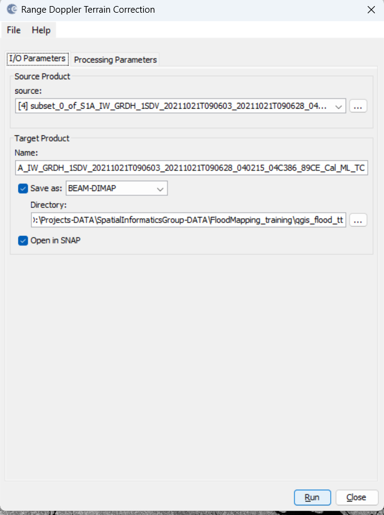

**Figure 12.** Terrain correction

4. Click Run. This process may take quite a few seconds to complete.
5. Click Close. Your newly added file will have a name with _Cal_ML_TC now becayse it is radiometrically calibrated, speckle reduced, and terrain corrected.
6. Add the Sigma0_VV band to the image viewer. You should now see a mirror image that looks more in line with the true color image in the World Viewer. It will be tilted.

###  Convert sigma0 to dB ###
Backscatter is conventionally represented in the units dB, which is a representation of the power of the signal.
1. Right-click on the Sigma0_VH band of the most recently corrected version of our image.
2. Select the Linear to/from dB option.
3. In the pop-up window, select Yes.
4. Repeat steps 1-3 for the Sigma0_VV band.
5. Add both of the new db bands to the image viewer and inspect the data.

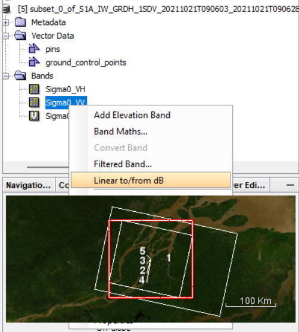

**Figure 13.** Converting to decibels

&nbsp;

 ## Now it’s time to work in QGIS ##
We need to add the sigma0_VV and sigma0VH layers, the ones that we obtained after the final correction (just before the decibel conversion).

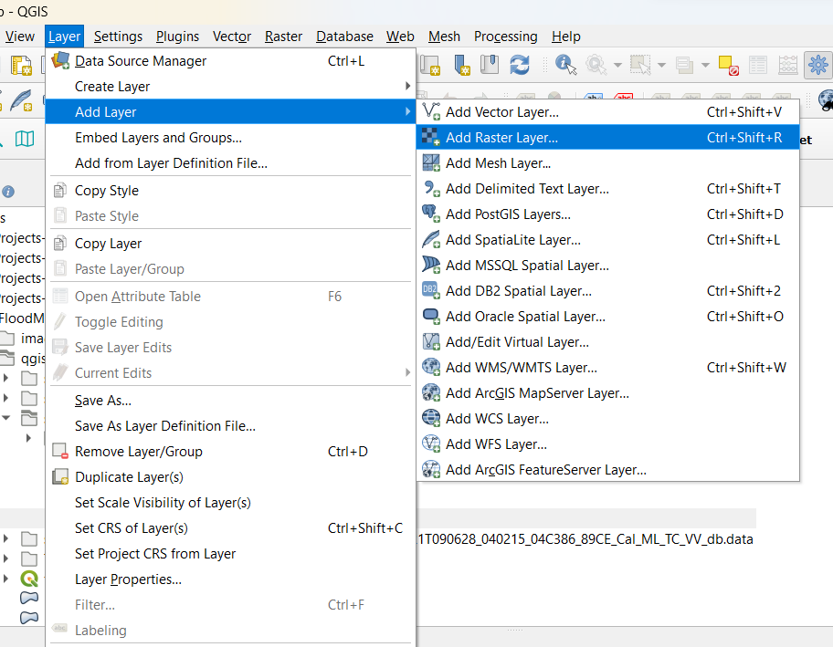

**Figure 14.** Adding the layers in QGIS

Go to your directory on your computer where you saved all the files from SNAP. You will be adding the Sigma0_VH.img and Sigma0_VV.img files to QGIS.

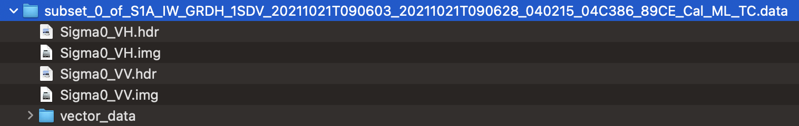

**Figure 14b.** Layers for QGIS

You should have made a similar set of files for January 2023 in a previous workshop. Later we will use these files. You can use the files from your computer, or download a prepared version from this [Drive Link](https://drive.google.com/file/d/1xcHr-WFPECQdacf6sENHtCWdHDJKqJrK/view?usp=share_link).

You will make the conversion again from linear units to decibels (amplitude) in QGIS using the Raster calculator. 

1. In the Raster Calculator Expression field, enter the following: `10*log10(VV)`.
2. Now highlight the portion of the equation where it says VV and input the actual band by double-clicking on the Sigma0_VV band in the Raster Bands field. 
3. Your equation should now read: `10*log10(“Sigma0_VV”)`, or something similar.
4. Click on the `...` next to the Output layer field. Save the file in the qgis_flood_tt folder and name it Sigma0_VV_db_Oct. Click OK. 
5. Click Run.
6. Repeat steps for the Sigma0_VH band.
7. Close the raster calculator.  

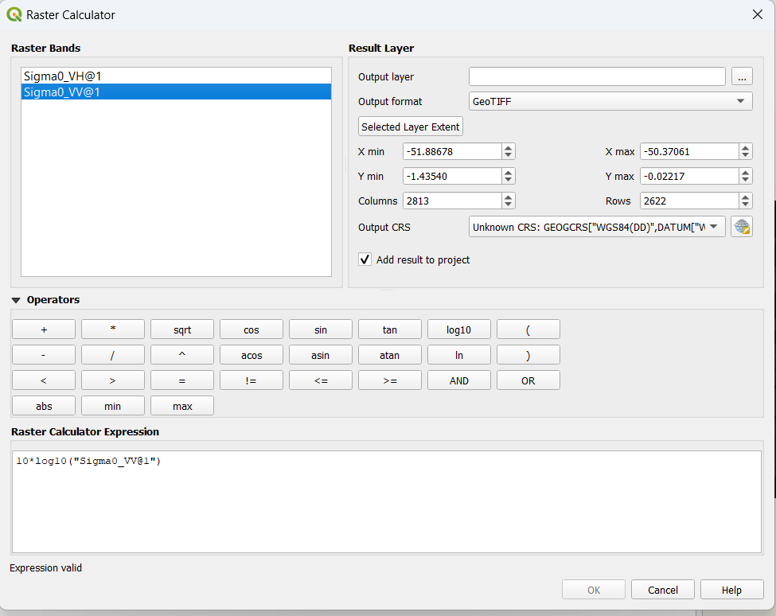

**Figure 15.** Conversion to decibels (db)

&nbsp;

Take a look at our image pre-processing computation so far.

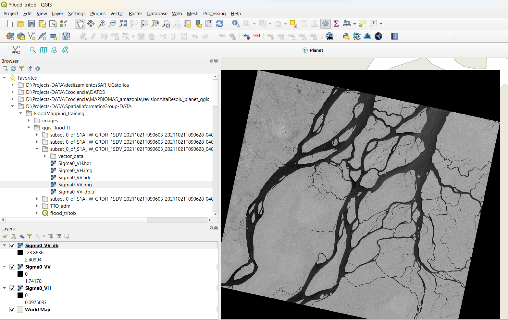

**Figure 16.** VV polarization in db units

&nbsp;

### Caluclate ratio ###
Now we calculate the ratio. The steps are the same we applied in our previous workshop. 
1. Select `Raster > Raster Calculator`.  
2. In the Raster Calculator Expression field, enter the following: *"Simga_VV_db_Oct@1"/"Sigma_VH_db_Oct@1"* or click the VV_db band then "/" then the VH_db band to create the equation. 
3. Click on the `...` next to the Output layer field. Save the file in the qgis_flood_tt folder and name it Sigma0_db_ratio_Oct.  
4. Click OK.

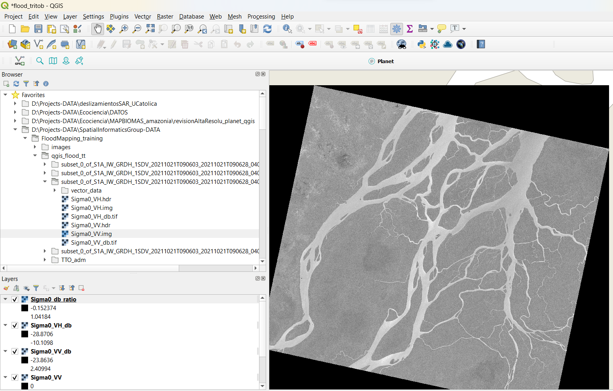

**Figure 17.** Ratio band computed

Tip: We can use a Planet visualization (if we have an account) to add a true color basemap and compare our SAR visualization. Otherwise we can use other basemaps available in QGIS. The built-in basemaps are located under XYZ Tiles on the browser menu on the left.

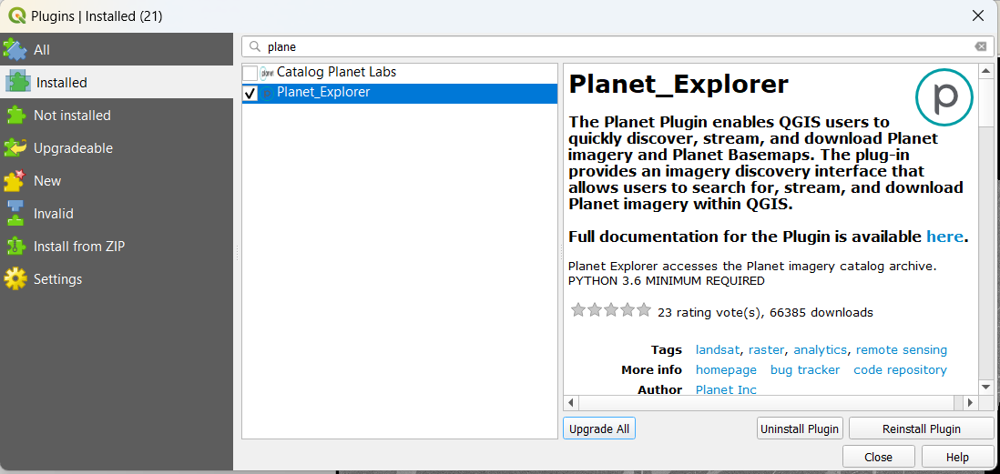

**Figure 18.** Planet plugin available to retrieve Planet imagery

*Optional* 
With this band we can create a RGB product, by merging Sigma0_VV_db_Oct, Sigma0_VH_db_Oct, Sigma0_db_ratio_Oct. You can use the Build virtual raster tool, or Raster>Miscellaneous>Merge. Be sure the selected db bands are in the correct order. 

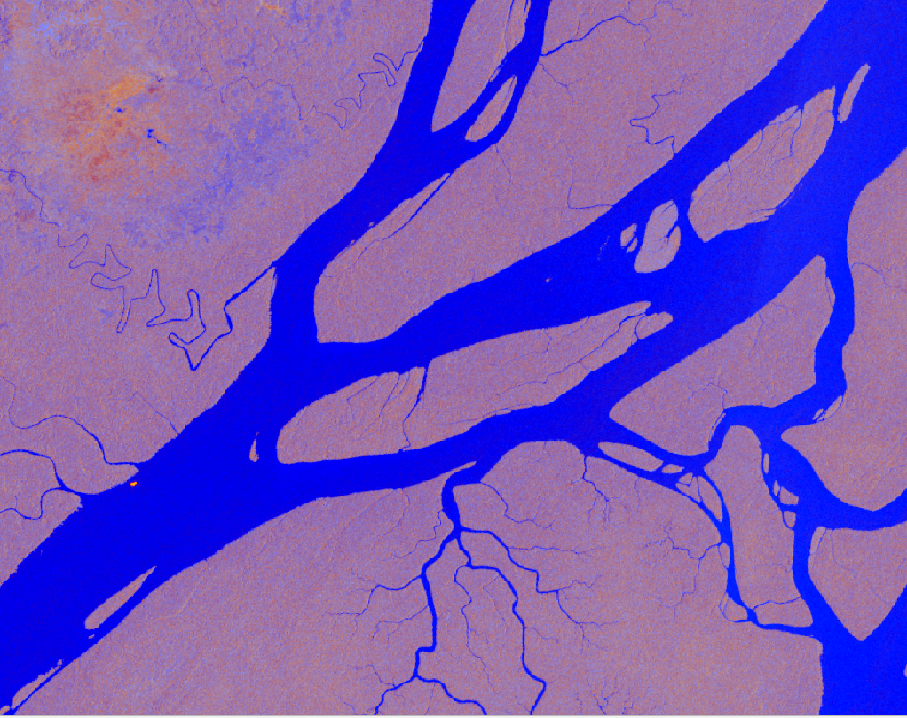

**Figure 19.** RGB visualization for the October 2021 SAR image.

Now it’s time to proceed to our classification of water /  non water by using a threshold. Confirm the threshold for our classification scheme.
1. Right-click on the Sigma0_VH_db@1 layer name and select Properties.
2. Click on the Histogram tab.
3. Click Compute Histogram.
4. A histogram with two peaks should appear. 
5. Confirm the value that separates the water values (minimum peak) from the non-water values (maximum peak).

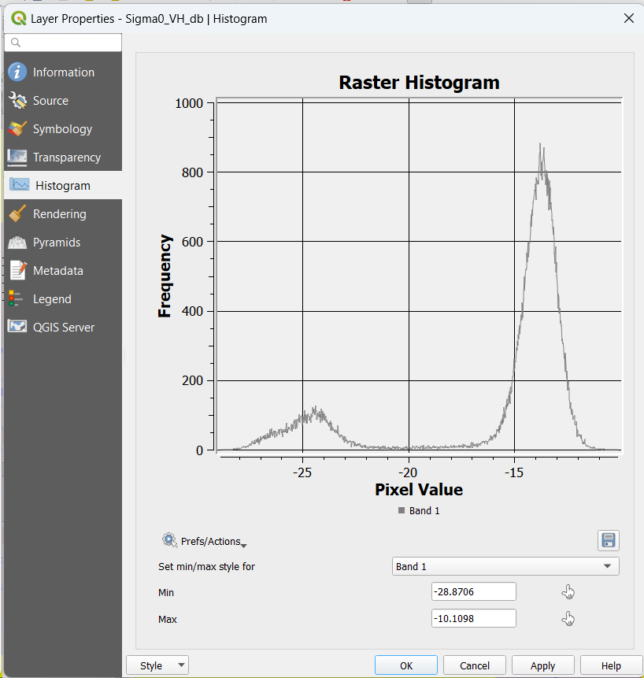

**Figure 20.** Histogram for our October 2021 SAR image.

It appears that the value is about the same, so we can use the same threshold that we did in the SNAP software. We can add our image from our past training corresponding to January 2023.

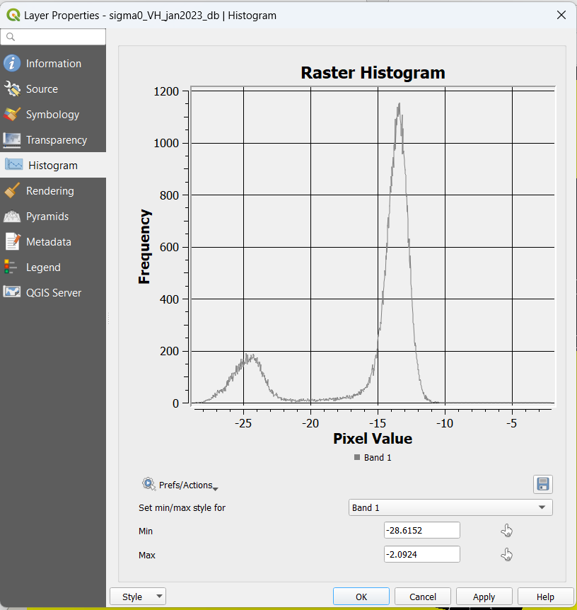

**Figure 20.** Histogram for our January 2023 SAR image.

Now, let’s continue with our October 2021 image, and create a binary image.
1. Select `Raster > Raster Calculator…`.
2. In the Raster Calculator Expression field, enter the following, being careful to include the parentheses: `255*(Sigma0_VH_db@1<-18.38)`
3.  Click on the `...` next to the Output layer field. Save the file in the folder and name it *water_nowater_oct2021*

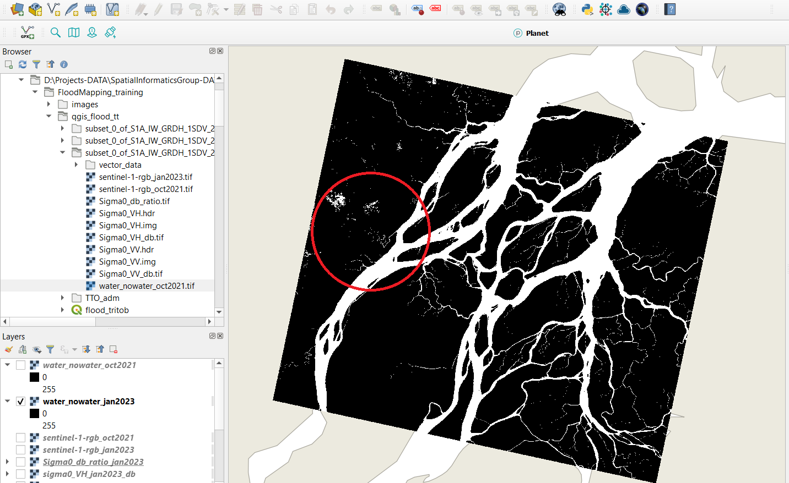

**Figure 21.** Water-non water image for October 2021. The red circle indicates the region we want to focus on for our flood detection procedure.

In figure 21 we can see a zone circled in red.  This is the area that we will focus on to compare the typical river to the water surface from a potential flood event that occurred in October 2021, by comparing it with January 2023. 

>If you have misplaced your data files from the previous training where the January 2023 flood map was generated, please download the zipped files from this [Drive Link](https://drive.google.com/file/d/1xcHr-WFPECQdacf6sENHtCWdHDJKqJrK/view?usp=share_link). 
> * Upload the Sigma0_VV and Sigma0_VH .img files to QGIS. 
> * Change the layer names to Sigma0_VV_Jan23 and Sigma0_VH_Jan23 so you can distinguish them from the October 2021 layers.
> * You will need to repeat the conversion from linear units to decibels (amplitude) in QGIS using the Raster calculator. 
    > 1. In the Raster Calculator Expression field, enter the following: `10*log10(VV)`.
    > 2. Now highlight the portion of the equation where it says VV and input the actual band by double-clicking on the Sigma0_VV band in the Raster Bands field. 
    > 3. Your equation should now read: `10*log10(“Sigma0_VV_Jan23”)`, or something similar.
    > 4. Click on the `...` next to the Output layer field. Save the file in the qgis_flood_tt folder and name it Sigma0_VV_db_Jan23. Click OK. 
    > 5. Click Run.
    > 7. Repeat steps for the Sigma0_VH_Jan23 band.
    > 6. Close the raster calculator.  
> * Now make the binary map of where water is observed for January 2023.
    > 1. Select `Raster > Raster Calculator…`.
    > 2. In the Raster Calculator Expression field, enter the following, being careful to include the parentheses: `255*(Sigma0_VH_db_Jan23@1<-18.38)` 
    > 3.  Click on the `...` next to the Output layer field. Save the file in the folder and name it *water_nowater_jan2023*

### Color the images ###  
1. Right-click on the *water_nowater_oct2021* image name in the Layers panel and click Properties. 
2. Select the Symbology tab. 
3. Next to the Render type field, choose Singleband psuedocolor from the dropdown menu. 
4. Select a color ramp or make your own. Make sure to follow the golden rules of data visualization.
5. Repeat this for *water_nowater_jan2023*.

### Now let’s apply the change detection technique! ### 
We will use the raster calculator to make a simple multi-temporal difference. Applying the most common change detection approach, let’s compute the difference between both dates using the Raster Calculator tool again. Use the equation `"water_nowater_oct2021" - "water_nowater_jan2023"`.

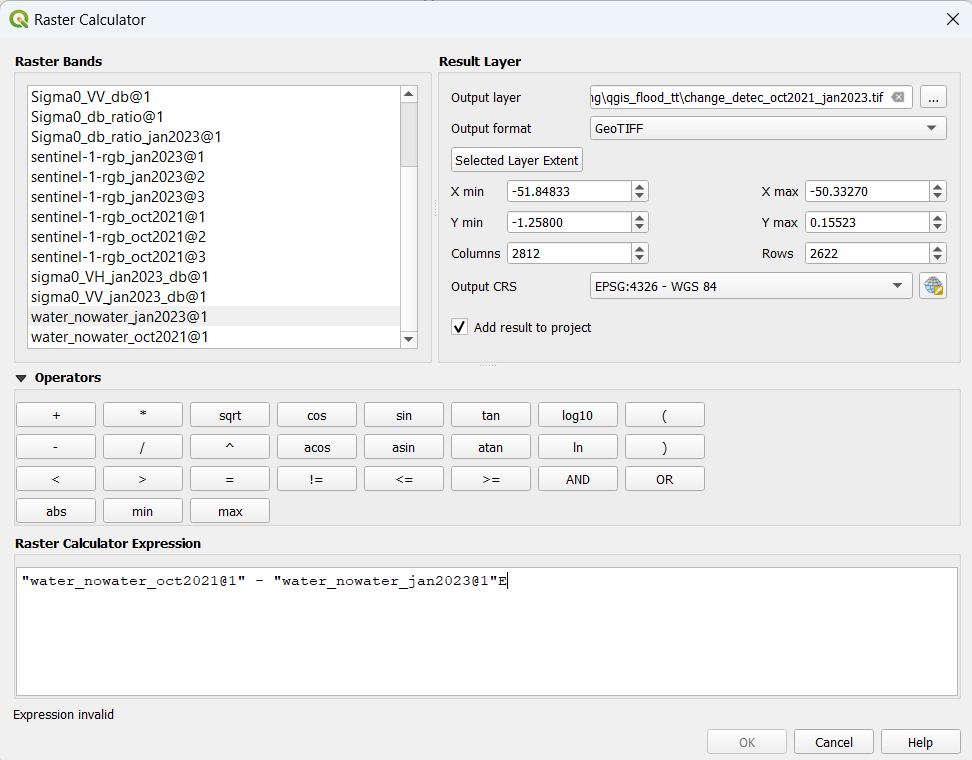

**Figure 22.** Multi-temporal change detection technique

Save the resulting product with the name Change_detec_oct2021_jan2023.tif. 

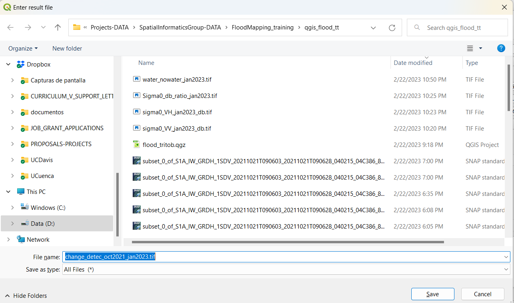

**Figure 23.** Saving the new file

Now let’s look at the final result. We should be able to identify the flooded areas with bright-white colors. October 2021 was a particularly rainy month.

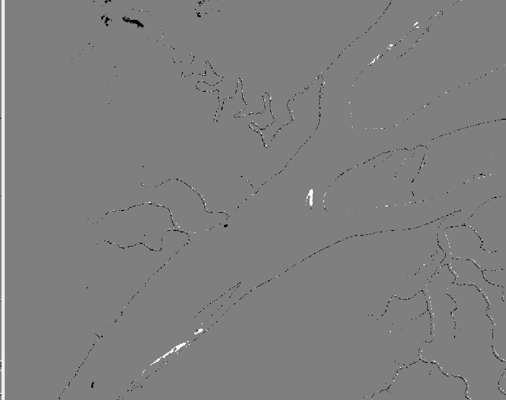

**Figure 24.** Multi-temporal change detection difference between a rainy month and a dry month

Using the symbology tool we can highlight the flooded parts by riverine flooding with blue color. October corresponds to the wet season, while January belongs to the dry season. Do this by altering the symbology to Paletted/Unique Values, with -255 in a 'dry' color like red, 0 a neutral color, and positive 255 in blue for flooded areas.

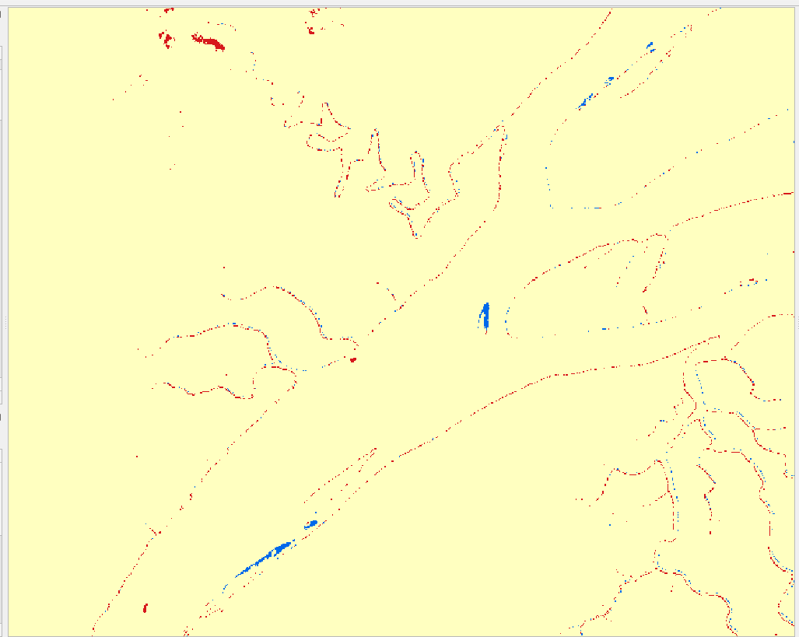

**Figure 24.** Multi-temporal change detection difference highlighting in blue the flooded regions. Product for October 2021, using January 2023 as reference for dry land.

Let’s use the measure tool to evaluate the area of one of the obvious flooded regions.

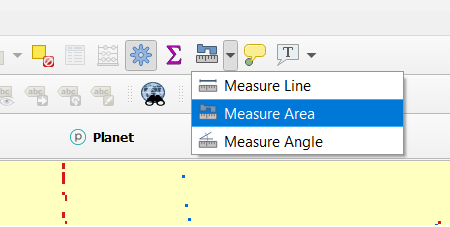

**Figure 25.** Measure area tool.

Now draw a polygon surrounding a flooded spot of your choice.  Try to point out a large one.

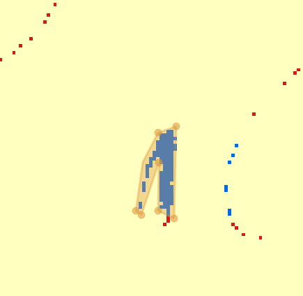

**Figure 26.** Tracing a polygon to measure the area of an identified flooded area.

You can look at the secondary window for the information about the computed estimate for area. You can select different arial units for this purpose.

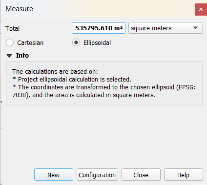

**Figure 27.** Measure window showing the calculated area

We found 535795.61 m² or 53.6 ha of flood occurred only in this region. The magnitude of change in water surface extent suggests this is not a normal situation of river flow, but rather a flood event. This estimate can vary a bit depending on the precision to draw the polygon of measurement around the flooded region.

Congratulations on finishing Exercise 1! You will visualize this map more in Exercise 2.  can create a map using the cartographical tools from QGIS.  Don’t forget the four main components: legend, scale, north arrow, and title.

&nbsp;

&nbsp;

## Exercise 1 - Challenges: 

 1. As a bonus exercise, create a map using the cartographic tools from QGIS.  Don’t forget the four main components: legend, scale, north arrow, and title.

 

Figure 28. Flood map produced for the study area.

2. Explore the platform SMAP Microwave Radiometer & Radar and make a short research about its functionality, data products, and applications. (https://smap.jpl.nasa.gov/). Write down a short paragraph about these items, and download a scene for your personal region of interest using the Alaska Satellite Facility domain just as an exercise of data access. Take a look at the metadata panel to see important data.
