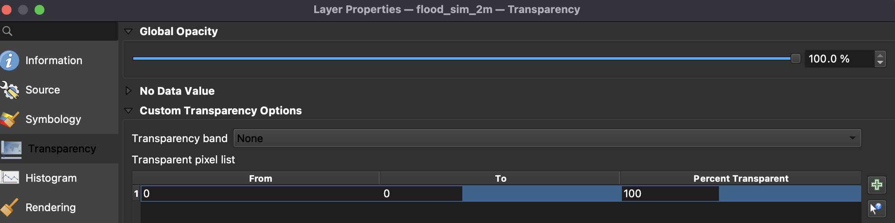

## Exercise 2: Mapping flood-prone areas using SRTM data in QGIS
*This exercise is an adaptation of [this tutorial](https://www.youtube.com/watch?v=QXQ92oVua3s)* 

We are going to investigate the same area as we did in Exercise 1 using a different data source, another type of radar data, the SRTM data from NASA. The SRTM, Shuttle Radar Topography Mission, collected 30 meter resolution elevation data of 80% of all of Earth's land (excluding some areas at the poles). This is a more generalized dataset than the Sentinel-1 data because it has a coarser resolution and is not continually updated. 

However, using SRTM is a great quick approach to finding areas of potential flooding. We can artificially 'flood' the low lying areas in the topography to simulate different flood severities. It could also be used for targeting more intesive analyses like you just completed to only the low-lying areas where flooding is likely. Remember, you have actually used SRTM data already during the Terrain Correction step.

Let's try some simulations and visualizations using SRTM in QGIS.

> A quick note. There are several acronyms for elevation data that can be confusing. Let's review the differences.  
* DSM: digital surface model --- oberves the surface features, including trees and buildings
* DEM: digital elevation model --- observes the bare ground elevation, which does not include vegetation of buildings 
* DTM: digital terrain model --- in some countries this is the same thing as a DEM, while in others it refers to a vector data set of regularly spaced points and contours that represent the bare ground elevation

We will be using a DEM generated using SRTM.

## Add SRTM in QGIS ##

You can keep working in the same QGIS project as Exercise 1. 

1. If you do not have it already, download the SRTM Downloader plugin. Once downloaded you will have a tool for it in your menu bar.

  

  

2. Zoom your canvas extent so you can see just a bit more than the full area of your current SAR and flood map layers.
3. Open the SRTM Downloader tool. 
4. Click `Set Canvas Extent`. 
5. Then click the `...` button and save the file to your qgis_flood_tt folder. Click `Download`. --- You will need to login to your EarthData account or make an account to for the download to complete.
6. The SRTM file(s) will be added to your project. Depending on how zoomed out you were, you may have too many files that you do not need. In this case the two squares of imagery at the top are not really needed, so we can delete them.

  

7. Now let's standardize the color ramp for the remaining SRTM images so they are one smooth visualization. Zoom in to the square that has the most area in which we are interested, such as the rivers on the top left of the change detection map. We will use this area to set our min max values to be used for the whole region.
8. Right click on that image and open `Properties`. Change the symbology to `Singleband psuedocolor`.
9. Open upt the Min/Max Value Settings options. Select `Min/max`, set the Statistics extent to the `Current canvas` and thenthe Accuracy to `Actual (slower)`. Then click `Apply`.
10. Play around with this a bit and adjust the color ramp if you like until you can see the topography clearly and are happy with the image. Them click `OK`.

  

11. Right click on the band name of the SRTM image you adjusted, go to `Styles > Copy Style`.
12. Right click on another of the other SRTM layers and select `Styles > Paste Style`. Repeat this for all the SRTM images. When you are done all of them will have the same mix/max and it will appear as one continuous image.

  

 13. If needed, merge the files into one raster. `Raster > Miscellaneous > Build Virtual Raster...`.
 14. Again, copy and paste the Style you made to this layer.

## Make the Simulation Flood Maps ##
Let's make a few flood maps assuming a few different values for the meters above sea level for a flood. We will use the merged SRTM layer to build these flood maps.

1. Open the Raster Calculator.
2. Type and equation using your merged SRTM layer less than 1 meter, `"SRTM_Merged_virtual@1" < 1`. All values below 1 meter in elevation will be marked as true, equal to 1, for flooded area. All the other ares will be zero. 
3. Save the file as *flood_sim_1m*.

Do you notice any white areas in the map that correspond to flooded regions from your *Change_detec_oct2021_jan2023* layer? Is the October 2021 flood more or less sever than what you would expect with a 1 meter sea level rise? Try this same process with a few more vales for the number of meters above sea level, like 2 meters and 5 meters.

 

## Visualizations ##
We can use our simulated flood maps in a few different ways for useful visualizations. In the figure examples we will use the 2 meter simulation, but use whichever one you wish.

1. Open the properties for your selected simulation flood layer.
2. Change the symbology to `Palleted/Unique values` and make the 1 value a blue color for water.
3. Go to the Transparency tab.
4. Depending on your version of QGIS the transparency tab might appear a bit different. Set the 0 value to transparent. 

 

 

5. Click OK. 
6. Try overlaying this flood map over your merged SRTM layer and your *Change_detec_oct2021_jan2023* layer. What do you notice?

 

## Exercise 2 - Challenges: 
1. You could try this in reverse and see only your *Change_detec_oct2021_jan2023* through the transparent flooded area and black out all the non-flooded areas.

2. See if you can discover a way to visualize the SRTM in 3D with the flooded simulation layer or your *Change_detec_oct2021_jan2023* overlayed on the surface.

3. Try using a flooded simulation layer as a geometry, with which you could clip your maps or determine areas of interest.

4. Make a visually appealing map of your flood results using the cartographic tools from QGIS. 