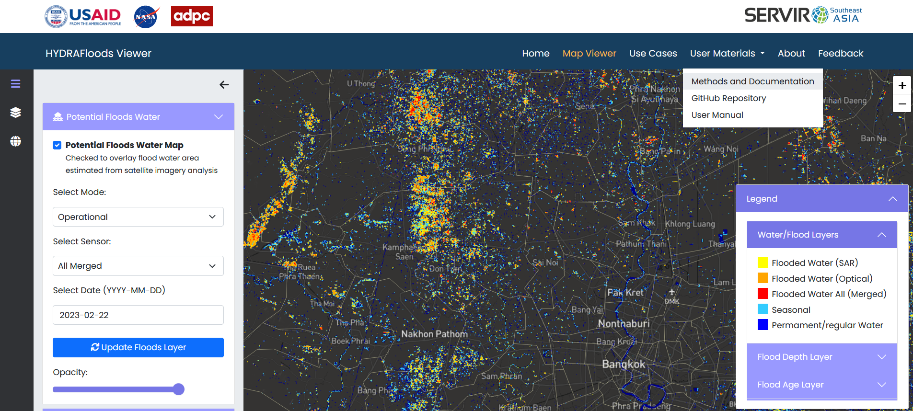

## Bonus: Review of HYDRAfloods

The HYDrologic Remote Sensing Analysis for Floods platform or HYDRAFloods is a publicly available, web-based, near real-time tool for enhanced flood monitoring. https://hydrafloods-servir.adpc.net/ HYDRAFloods helps with emergency response and relief sectors by providing flood extent information. This flood monitoring system uses open-source satellite remote sensing data from optical and Synthetic Aperture Radar (SAR) sensors. In addition, it was developed in Google Earth Engine and Google Cloud Platform with Python API.

Let’s explore the different menus, such as materials, methodology & documentation, and use cases.	

**Figure 29.** HYDARFloods viewer

&nbsp;

## Survey and Q&A ##
Thank you for participating in the workshop today. Please take a few minutes to fill out the survey for this session.

Feedback survey:    
[https://docs.google.com/forms/d/e/1FAIpQLSdk81jKgzDMyEFm3y5FdaiB7oTz5rzJ-rF6elyA_bUECLL2Ww/viewform]  

Also, please submit any questions you would like to cover in the Q&A session next workshop via the form at the start of this website. Questions should be submitted in advance of the session. 