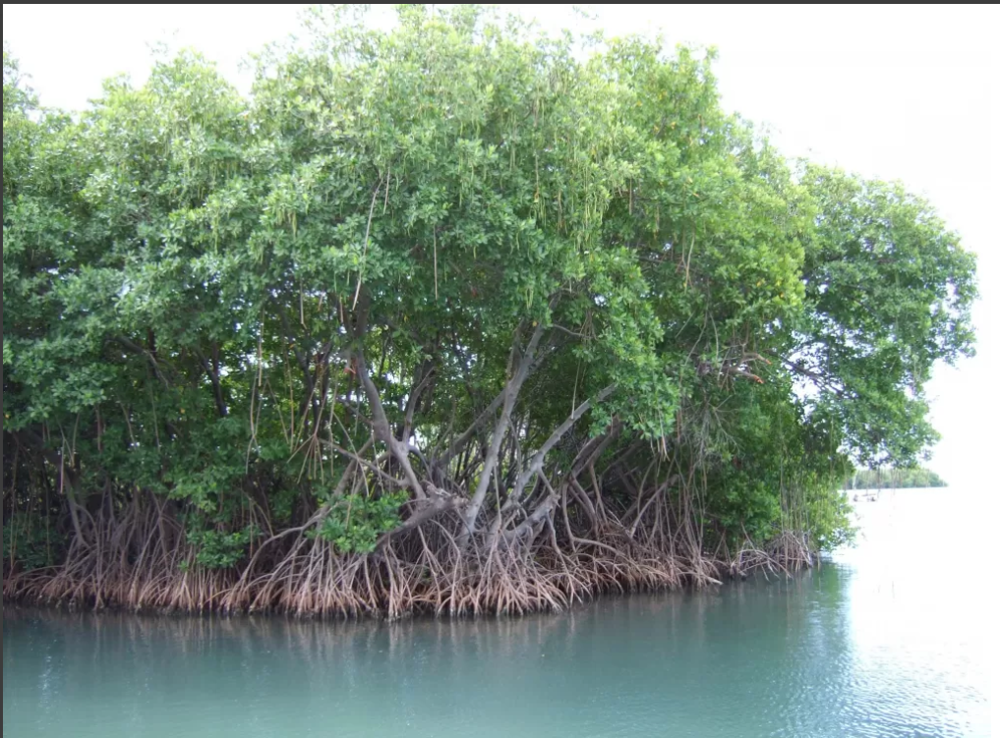

## Mangroves fundamentals

Mangroves are a set of trees or shrubs that grows in tropical coastal swamps that are flooded at rainy seasons or high tides. They usually have tangled roots above the ground forming dense thickets. Mangroves provide numerous ecosystem services:
    – Nutrient Cycling
    – Fishery Support
    – Flood Control
    – Water Quality
    – Coastline Stabilization
    – Carbon Sequestration

