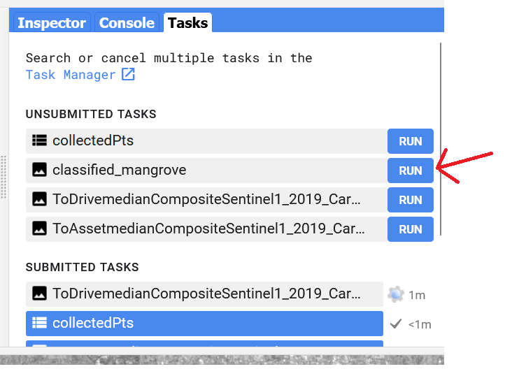
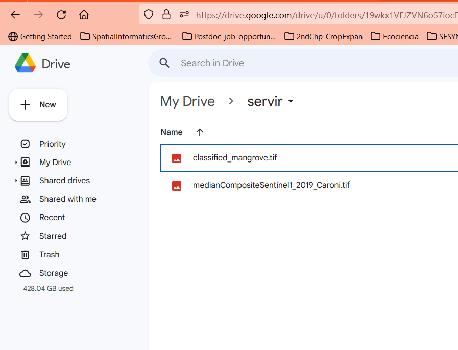
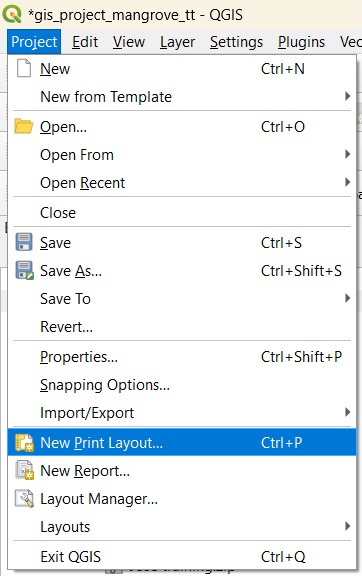
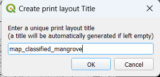
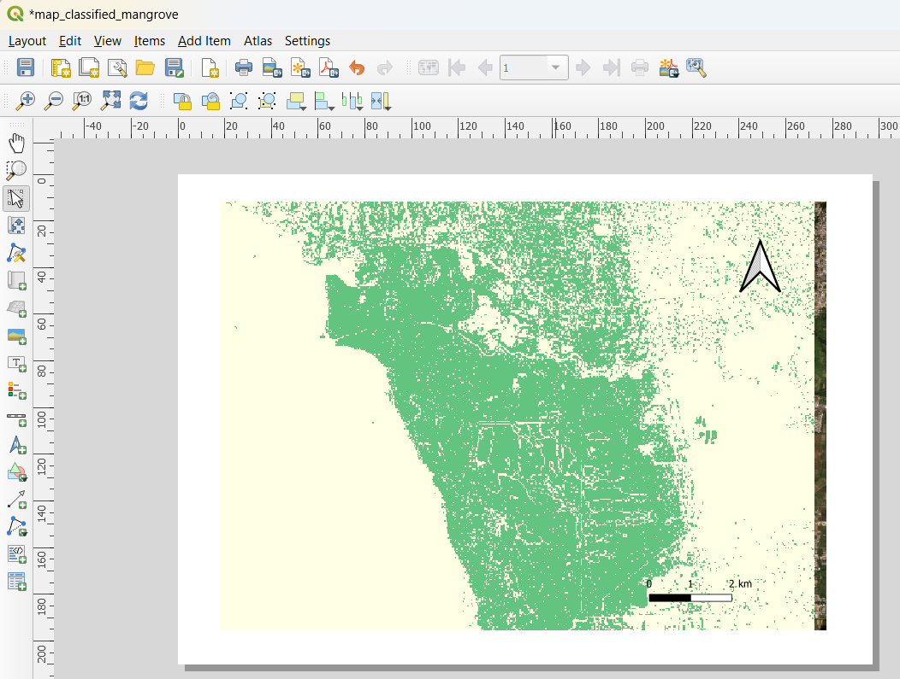

# Exporting and Mapping your classified product

We have produced our classified mangrove product based on Sentinel-1 C data using Google Earth Engine (GEE) through a pixel-based machine learning method. Now we need to export the product into our Google Drive, and loaded in a QGIS project to create a cool map.  Our last step in GEE is to export the product


```javascript
Export.image.toDrive({
  image: RFclassification,  
  description: 'classified_mangrove', 
  folder:'servir', 
  fileNamePrefix: 'classified_mangrove',
  scale: 30,
  maxPixels: 1e13
});
```



Now we can find our product in the Google Drive folder



Now let's open QGIS and start working on the mapping

  

Let's provide a good symbology to our product, and finalize the rest of map components

