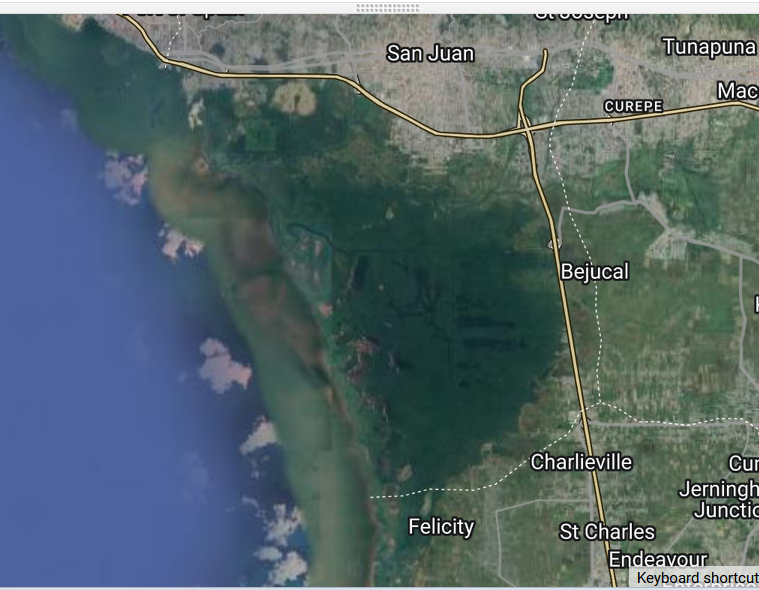

# Step-Through Part 1

# Overview 

In this workflow, we will create a composite of radar data from the Sentinel-1 C band mission, filter the image archive down to a desired time period of interest, then use the data to classify mangrove presence using a Random Forest classification model. 

Follow along by copying and pasting each code block in the lesson into your own blank script. At the end you will have the entire workflow saved to a script file on your own GEE account.

# Setting up Area of Interest
An area of interest can be uploaded from a local shapefile, drawn on the map, or derived from a pre-existing dataset in the Earth Engine catalogue. Here we will create our own box around an coastal area in the country of Trinidad and Tobago

```javascript
//--------------------------------------------------------------
// Define vector data (Area of interest, aoi)
//--------------------------------------------------------------

var box = 

    ee.Geometry.Polygon(
        [[[-61.52775230122637, 10.684576904414374],
          [-61.52775230122637, 10.503692778496433],
          [-61.39522971821856, 10.503692778496433],
          [-61.39522971821856, 10.684576904414374]]], null, false);


var aoi = box


// Center the Map on the aoi object, with a specified zoom-level (between 1-24)
Map.centerObject(aoi, 12);

// Add the aoi object as a layer to the map
Map.addLayer(aoi, {}, 'AOI');
```



# Preprocessing Image Collections 

We always want to apply filters to `ImageCollections` as early in our workflow as we can to reduce the amount of effort the GEE servers will require. We already know the area that we'd like to pull data for (our AOI).

Let's do that for our first Sentinel-1 `ImageCollection`

```javascript
//--------------------------------------------------------------
// Define raster data
//--------------------------------------------------------------

// We will work with Sentinel-2 images.
// Search on the Search bar for 'Sentinel-2 level 2'.
// Level 2A - Highest quality, "bottom-of-atmosphere": reflectance.

// Inspect the properties in the dataset description.
// https://developers.google.com/earth-engine/datasets/catalog/COPERNICUS_S2_SR
// Get the Sentinel-1 collection and filter by space/time.
var s1 = ee.ImageCollection('COPERNICUS/S1_GRD')


// Filter collection according to aoi, time period, and instrument mode. 
// We will work with images from 2019 to 2021.
var s1filtered = s1.filterBounds(aoi)
                   .filterDate('2019-01-01', '2019-12-31')
                   .filter(ee.Filter.listContains('transmitterReceiverPolarisation', 'VV'))
                   .filter(ee.Filter.eq('orbitProperties_pass', 'ASCENDING'))
                   .filter(ee.Filter.eq('instrumentMode', 'IW'));


// Print filtered collection.
print('Sentinel-1 Filtered Collection', s1filtered);
var s1preProcessed = s1filtered
```

Now we have filtered our SAR image. Next, we visualize first non-processed and pre-processed images

```javascript
//--------------------------------------------------------------

// come up with some type of preprocessing step..

// Select first non-processed image.
var firstNonProcessed = s1filtered.first();

// Define visualization parameters.
var visParamNonProcessed = {
  bands: ['VV'],
  min: -25,
  max: 0,
};

// Add image to map.
Map.addLayer(firstNonProcessed, 
            visParamNonProcessed, 
            'First non-processed image');


// Select first pre-processed image.
var firstPreProcessed = s1preProcessed.first();

// Define visualization parameters.
var visParamPreProcessed = {
  bands: ['VV'],
  min: -25,
  max: 0
};

// Add image to map.
Map.addLayer(firstPreProcessed, 
            visParamPreProcessed, 
            'First pre-processed image');

```
Create an aggregated image. We use the following functions to compare different aggregations: .min(); .max(); .mean(); .median()
We will choose the median as statisics to compute our composite


```javascript
// We will work with the Median composite.
var composite = s1preProcessed.median().clip(aoi);

// Add composite to the map.
Map.addLayer(composite, visParamPreProcessed, 'Median Composite');


//--------------------------------------------------------------
// Export composite to Drive or Asset
//--------------------------------------------------------------

// Export composite to Google Drive.
Export.image.toDrive({
  image: composite.toFloat(),
  description: 'ToDrivemedianCompositeSentinel1_2019_Caroni',
  fileNamePrefix: 'medianCompositeSentinel1_2019_Caroni',
  region: aoi,
  scale: 10,
  maxPixels: 1e13
});

// Export composite as a GEE Asset.
Export.image.toAsset({
  image: composite,
  description: 'ToAssetmedianCompositeSentinel1_2019_Caroni',
  assetId: 'medianCompositeSentinel1_2019_Caroni',
  region: aoi,
  scale: 10,
  maxPixels: 1e13
});
```

Now, we collect our training data. We will use the collected points dataset:

"https://code.earthengine.google.com/?asset=projects/croplandexpansionandes/assets/collectedPts"

You can click on Import then name is as **collectedPts**


```javascript
var collectedPts = ee.FeatureCollection("projects/croplandexpansionandes/assets/collectedPts")

// Extract spectral information at each point.
var trainingPts = composite.sampleRegions({
    collection: collectedPts, 
    properties: ['class'], 
    scale: 10,
    geometries:true
  });
print('Training Points', trainingPts);
```

Congratulations, you now have an `ImageCollection` consiting of SAR data ready to be used. Continue onto Step Through Part 2 to finish your workflow.
