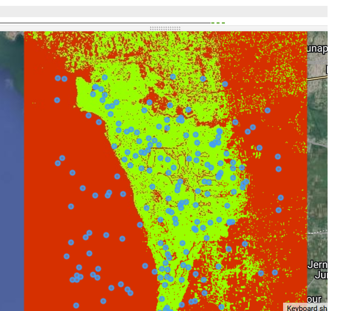
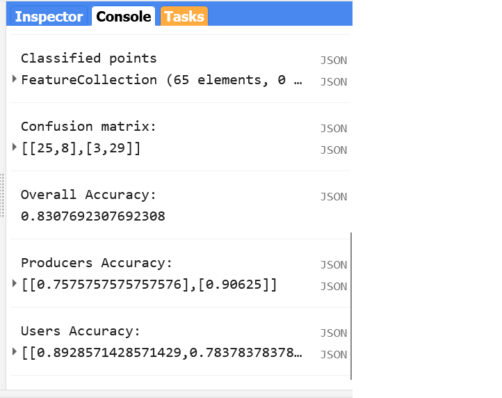

# Step-Through Part 2

# Image Compositing

We've now got an `ImageCollection` consisting of SAR Sentinel 1 C band. Now it is time to train the machine learning method and make a classification of the area.

*Note*: At a given pixel in your composite, if every single image in your `ImageCollection` was masked in that location (due to preprocessing in our case), then the composite will also be masked there. This can be remedied by more nuanced preprocessing algorithms and filters for the `ImageCollection`, but is beyond the scope of this demonstration.

# Sample Data

To train a mangrove classification model, we need presence/absence data on the locations of mangroves.


```javascript

//--------------------------------------------------------------
// Classification
//--------------------------------------------------------------

// Define prediction bands.
var predictionBands =  ["VV","VH","angle"];

// Random Forest Classifier.
// "Call" the random forest classifier and train it with the training points.
var RFclassifier = ee.Classifier.smileRandomForest({numberOfTrees:10}).train({
  features: trainingPts, 
  classProperty: 'class',
  inputProperties: predictionBands
});

// Print decision trees.
var decisionTrees = RFclassifier.explain();
print('Decision trees', decisionTrees);

// Define color palette for the classified image (grab from geometry tools for each class).
var colorPalette = ['d63000', '98ff00'];

// Classify the median composite.
var RFclassification = composite.classify(RFclassifier);
Map.addLayer(RFclassification, {min: 0, max: 1, palette: colorPalette}, 'RF Classification');

```

We have created classified map where only mangrove ecosystems have been detected.



Now it's time to compute the accuracy of the model. Now we are going to train a Random Forest classifier with ONLY the training point subset this time. Then we take this trained RF classifer to classify the testing point subset. Finally, we retrieve the error matrix from the classified test set and print accuracy metrics to the console. 

```javascript
//--------------------------------------------------------------
// Pre-validation
//--------------------------------------------------------------

// Divide points into training and testing points.

// Create random column in reference points.
var trainingTesting = trainingPts.randomColumn();
print(trainingTesting);

// Divide 80% of data for training and 20% for testing.
var trainingData = trainingTesting.filter(ee.Filter.lt('random', 0.8));
print('Number of training points', trainingData.size());

var testingData = trainingTesting.filter(ee.Filter.gte('random', 0.8));
print('Number of testing points', testingData.size());

Map.addLayer(trainingData, {color: '429ef5'}, 'Training points'); // Blue
Map.addLayer(testingData, {color: '000000'}, 'Testing points'); // Black


// Train the classifier with training points only.
var RFclassifierVal = ee.Classifier.smileRandomForest(10).train({
  features: trainingData, 
  classProperty: 'class',
  inputProperties: predictionBands
});

// Now, test the classification (model precision) with testing data.
var classificationVal = testingData.classify(RFclassifierVal);
print('Classified points', classificationVal);

// Create confusion matrix.
var confusionMatrix = classificationVal.errorMatrix({
  actual: 'class', 
  predicted: 'classification'
});

// Print Confusion Matrix and accuracies.
print('Confusion matrix:', confusionMatrix);
print('Overall Accuracy:', confusionMatrix.accuracy());
print('Producers Accuracy:', confusionMatrix.producersAccuracy());
print('Users Accuracy:', confusionMatrix.consumersAccuracy());
```



Congratulations! You have setup a Random Forest classifier for mangrove mapping using SAR data. 
